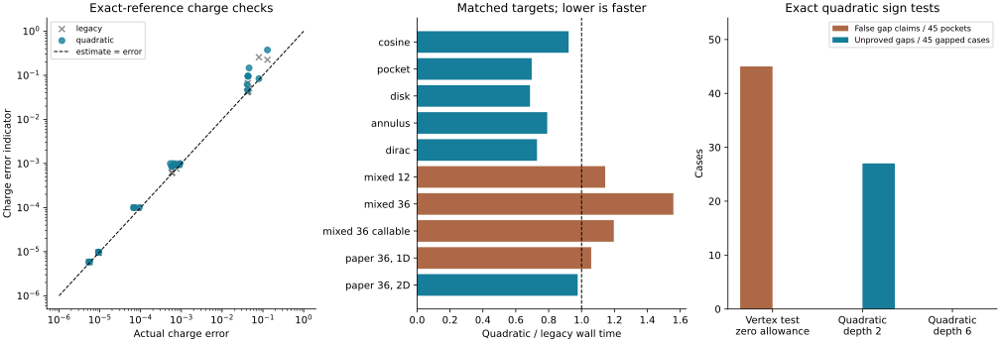

# Experimental occupation enclosure

## Goal and baseline

Unify the sampled occupation test and charge error indicator in FermiSimplex.
The baseline is MeanFi `54eab84` with FermiSimplex `13aeda0`; the experiment
uses the latest AdaptiveSimplex `5ea4787`. The paper was inspected at `b3735fe`.
The companion FermiSimplex implementation is pinned at
[`98c5009`](https://gitlab.kwant-project.org/qt/lineartetrahedron/-/commit/98c5009e78ca45a7e8e543d96f8fac4a4915fe70).
No new runtime dependency is needed. The current `nk` behavior is unchanged.

## Model

On each mesh simplex, interpolate `K = H - mu I` by a quadratic Hermitian
matrix in Bernstein form, using vertices and edge midpoints. Probe quarter
edges, triangular face centers and the cell center to estimate its remainder
`eta`. The default allowance is twice the largest sampled defect norm, with a
roundoff floor. For Hermitian matrices use the smaller of the Frobenius norm
and the maximum absolute row sum; both bound the operator norm. This avoids
inflating a common shift of all bands by the square root of the band count.
This is a sampling assumption, not a uniform proof. An optional
explicit uniform interpolation bound replaces this empirical allowance.

In a vertex eigenbasis, prove negative and positive safe sectors on every
Bernstein control matrix with margin exceeding `eta`. Their minimum margin
gives `Delta > 0`. Keep the remaining contiguous states active. Failed safe
tests enlarge the active space, including the full matrix when necessary.

Let `B1` interpolate the active/safe coupling at vertices and set
`X = D0^-1 B1`. Use the quadratic reduced polynomial

`P = A2 - B1* D0^-1 B1`.

The variational Schur identity `S = Y - F* D^-1 F`, with
`Y = A - B*X - X*B + X*DX` and `F = B - DX`, gives

`epsilon = eta + 2 b x + d x^2 + (b + d x)^2 / Delta`,

where `b >= ||B-B1||`, `d >= ||D-D0||`, and `x >= ||X||` are obtained from
Bernstein controls and matrix norm bounds. For a smooth local family with a
uniform safe gap, `b=O(h^2)`, `d,x=O(h)`, and `eta=O(h^3)`: the allowance
is cubic, with a quartic solve-residual contribution. Full-space fallback
uses `P=K2`, `epsilon=eta`.

## Occupation and charge

The same polynomial and allowance supply sign tests and charge intervals.
Strict negative/positive projected control matrices prove occupation bounds.
A collapsed interval proves no zero of the modeled enclosure. It is a
conditional certificate for a sampled remainder, or a uniform certificate
when the supplied remainder bound is valid. It does not bound the numerical
gap of the full Hamiltonian by the reduced gap.

Temporary subdivision restricts this fixed polynomial exactly; it adds no
Hamiltonian evaluations and never shrinks `epsilon`. At terminal cells, rotate
into the polynomial's center eigenbasis. Bound quadratic diagonal curvature
and off-diagonal row sums uniformly by Bernstein controls. Integrate the
resulting affine diagonal cuts shifted by these radii plus `epsilon` using
AdaptiveSimplex's existing cut-volume rules. This bounds the model integration
error as well as the model discrepancy. Constant integer sign bounds tighten
the interval. The charge reported to MeanFi remains the mesh's linear-band
charge; its error indicator is the greatest distance to the interval endpoints.
The diagonal curvature bound uses the maximum sum of edge Bernstein weights,
`d/(d+1)`. Cut comparisons include an outward roundoff allowance. Gershgorin
row bounds precede Cholesky and eigensystem work; an already diagonal center
keeps its frame without dropping off-diagonal entries from the bounds.

The reported linear-band charge generally remains second order. Neither the
cubic matrix allowance nor this bounded-depth polynomial integration promises
cubic charge convergence. Tangencies and unresolved bands can widen intervals.

The density-cut indicator also accounts for spatial cut disagreement with the
reported affine cuts. A scalar charge cancellation must not hide displaced
occupied regions. Flat bands retain half occupation in the reported charge;
strict interval endpoints conservatively include zero contacts.

## Verification

Compare against the unchanged estimator on identical starting meshes and
resource limits. Use exact polynomial pockets, regular crossings, tangencies,
rotating multiband models, and periodic bands with analytic or converged dense
references. Report actual charge errors, interval coverage, false gap claims,
Hamiltonian/eigensystem counts and wall times. Check local cubic matrix error
separately from charge convergence. Include a deliberately unsampled feature
to exhibit the sampling limitation. Keep runs bounded; no long SCF sweep.

The experiment is opt-in through `FermiSimplex(charge_method="quadratic")`;
`"legacy"` retains the baseline for comparisons. Implementation and native
tests live in the FermiSimplex companion branch of the same name.

## Use

```python
integration = meanfi.FermiSimplex(charge_method="quadratic")
result = meanfi.density_matrix(h, filling=0.37, keys=[(0,)], integration=integration)
```

The selection controls adaptive charge calculations at fixed filling. Direct
fixed-mu density calculations and prescribed `nk` calculations do not run the
independent charge estimator.

FermiSimplex also exposes the shared sign test and charge interval directly:

```python
mesh = fermisimplex.SpectralMesh(h)
charge = mesh.integrate_charge(mu=mu, target_error=1e-4, method="quadratic")
enclosures = mesh.occupation_enclosures(mu=mu, depth=2)
```

Each result corresponds to a row of `mesh.simplices` and reports occupation
bounds, charge endpoints, active dimension, safe gap and error allowances.
`fixed_occupation` requires strict sign exclusion; it is conditional when
`remainder_is_sampled` is true. Supply `interpolation_error_bound=...` only when
a uniform bound for the quadratic interpolation has been established on every
current simplex. The existing vertex-only `certify_simplex` and surface
extraction API retain their explicit affine-interpolation contracts; use
`occupation_enclosures` for this experimental quadratic test.

## Results (2026-09-30)

The shared enclosure caught the quadratic-pocket failure and covered all 24
exact-reference charge checks. Runtime improved on the scalar and Dirac
cases, stayed close to the baseline on the paper inputs, and increased for
the mixed multiband cases. Keep this as an experimental option.

### Charge accuracy and cost

The table uses each model's tighter tested target. Charge errors are electrons
per cell. The time ratio is quadratic / legacy; values below one are faster.

| Model | Target | Actual error, legacy → quadratic | Indicator, quadratic | Time ratio |
| --- | ---: | ---: | ---: | ---: |
| cosine | 1e-05 | 5.64e-06 → 5.64e-06 | 5.87e-06 | 0.92 |
| pocket | 1e-05 | 5.37e-06 → 5.37e-06 | 5.81e-06 | 0.70 |
| disk | 1e-04 | 8.62e-05 → 9.26e-05 | 9.97e-05 | 0.69 |
| annulus | 1e-04 | 6.8e-05 → 6.71e-05 | 9.99e-05 | 0.79 |
| dirac | 1e-04 | 8.82e-05 → 6.89e-05 | 9.99e-05 | 0.73 |
| mixed_12 | 1e-05 | 9.31e-06 → 9.31e-06 | 9.78e-06 | 1.14 |
| mixed_36 | 1e-05 | 9.31e-06 → 9.31e-06 | 9.78e-06 | 1.56 |
| mixed_36_callable | 1e-05 | 9.31e-06 → 9.31e-06 | 9.78e-06 | 1.20 |

Both methods reached every adaptive target in this analytic set. Three
legacy indicators slightly underestimated error on the initial coarse mesh
(cosine and the two 36-band representations); both methods covered every
refined result. These few cases do not establish a statistical coverage rate.

For the paper's frozen 36-orbital inputs:

| Dimension | Target | Actual error, legacy → quadratic | Time, legacy → quadratic | Refinements, legacy → quadratic |
| --- | ---: | ---: | ---: | ---: |
| 1D | 1e-03 | 0.000592 → 0.000648 | 0.0278 s → 0.0294 s | 37 → 36 |
| 2D | 1e-02 | 0.00404 → 0.00308 | 2.17 s → 2.11 s | 1259 → 1496 |

Both methods exhausted 2,000 refinements at the paper's 2D `1e-3` target.
This is retained as a resource failure. There were no long SCF runs.
The 1D reference is analytic (filling residual below `4e-15`). The saved 2D
reference reports axis-exchange agreement `2.22e-16`, quadrature estimate
`7.53e-12`, and a density accuracy target `1e-8`; even a conservative
36-orbital trace uncertainty `3.6e-7` is small relative to the measured errors.

At the disk's `1e-4` target, Hamiltonian evaluations fell from 19,587 to 7,551
and eigensystems from 4,844 to 251. Native tight-binding projection makes the
old estimator particularly efficient for the mixed 36-band case: its 15 full
Hamiltonian evaluations become 87, despite fewer eigensystems. That case
remains about 56% slower. Polynomial and projected-matrix work is still
charged even when diagonalization is skipped.

### Gap claims and approximation order

- On 45 exact quadratic pockets, the vertex test with zero interpolation
  allowance made 45 false gap claims; the new enclosure made zero. This
  compares the root sign tests. The legacy charge estimator often detects
  curvature later, so these are not 45 charge-integration failures.
- On 45 genuinely gapped quadratics, the new depth-two test proved 18 gaps.
  Depth six proved all 45, using the same Hamiltonian samples. The old vertex
  test proved all 45 immediately. Improved reliability costs some early exits.
- An explicitly tested compact bump between every probe still fools the
  sampled test. A supplied uniform remainder bound prevents that claim.
  Sampling does not rule out arbitrary hidden pockets.
- Exact Schur solves on a complex three-band model with an indefinite safe
  block gave errors `7.894e-6`, `9.934e-7`, `1.246e-7`, `1.560e-8` at
  sizes `0.2`, `0.1`, `0.05`, `0.025`. Allowances were `4.345e-5`,
  `5.362e-6`, `6.658e-7`, `8.295e-8`. Both decrease cubically.



### Reproduce and scope

Timings use the same Release binary for both methods, GCC 14.3, Python
3.13.15, NumPy 2.5.3 and one BLAS/OpenMP thread on an Intel Xeon Gold 5418Y.
Reported medians use five repeats for analytic models and three for paper
models. CPU affinity was not pinned; treat small timing differences and
submillisecond cases cautiously. Both methods use `root_level=2`, depth two
and identical resource caps (3,000 refinements for analytic cases).

The FermiSimplex branch contains `benchmarks/occupation_enclosure.py`; run it
with `--output charge.json --repeats 5`. From this MeanFi checkout run:

```sh
OPENBLAS_NUM_THREADS=1 OMP_NUM_THREADS=1 python performance/occupation_enclosure.py \
  --paper /path/to/meanfi-paper --output paper.json --repeats 3
python performance/plot_occupation_enclosure.py \
  --native-results docs/experiments/occupation/charge.json \
  --paper-results docs/experiments/occupation/paper.json \
  --output docs/experiments/occupation/comparison.svg
```

Raw [analytic results](experiments/occupation/charge.json) and
[paper results](experiments/occupation/paper.json) include every timing sample,
work count, target and failure. The paper checkout is `b3735fe`; no manuscript
changes are required to reproduce these tests.

Validation: the MeanFi default suite passed 798 checks (43 skips, 35 slow
checks deselected); FermiSimplex passed 171 Python tests and 10 native test
groups. Tests include exact 1D/2D/3D pocket volumes, contacts and flat bands,
charge cancellation with displaced cuts, cubic Schur error, and the MeanFi
filling solve and Fourier density moment against their analytic values.
