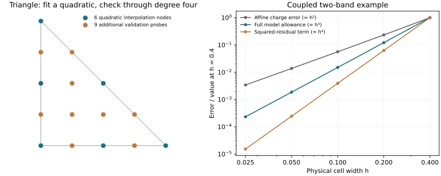
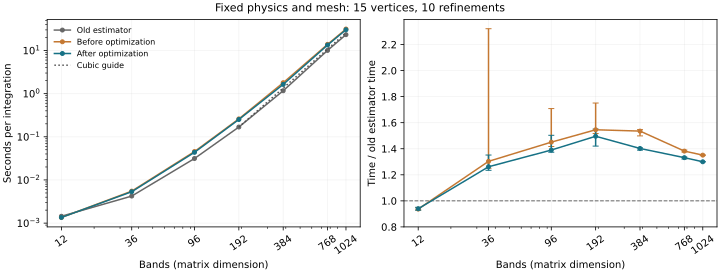
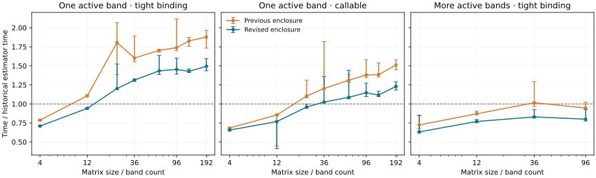

# Occupation enclosure: design and measured results

## Scope

Use one reduced matrix model for gap classification and charge error. The
experimental branch now has one implementation: no `charge_method`, `method`,
boolean switch or legacy charge backend. Historical builds supply comparisons.
The native surface classifier uses the same enclosure as charge integration.
The separate vertex-only `certify_simplex` remains an affine-matrix primitive
with an explicit remainder contract; adaptive calculations no longer use it.

Base: MeanFi `54eab84`, FermiSimplex `13aeda0`, AdaptiveSimplex `5ea4787`, paper
`b3735fe`. The previous experimental implementation is FermiSimplex `98c5009`.
Current native pin: [23b6ac1](https://gitlab.kwant-project.org/qt/lineartetrahedron/-/commit/23b6ac13ceeabe46d887b6b5540f4604e8b87795).
The review cleanup below compares `8430c4d` with `cf266b7`; `23b6ac1` only
formats a benchmark. The preceding
direct-evaluation and dimension-general probes follow-up compares `cf266b7`
with `9f06d36`.
The pre-optimization version is `ae3ce87`; earlier tables explicitly describe
that revision. The larger-band follow-up below measures both revisions.
No new dependencies, long SCF runs, or changes to the deferred `nk` behavior.

## Review cleanup

The quartic lattice, remainder factor, Schur allowance and subdivision rule
are retained. Five changes remove unnecessary work or stale implementation
details:

1. **Constant occupation has zero derivative.** When `mu` lies strictly outside
   a band's vertex-energy range, skip its divided-difference derivative.
   For `H(x,y)=1e-8*(x+y)` and `mu=1`, the former calculation returned
   `dQ/dmu=1.1102230246251565`; the result is now exactly zero. Both charges are
   exactly one. Vertex energies are collected once for charge and derivative.
   Endpoint conventions are retained.
2. **Accumulate probe residuals directly.** Subtract the quadratic controls
   into each evaluated Hamiltonian, avoiding a separate interpolated matrix
   and difference copy. Reuse the row-sum workspace for matrix norm bounds.
3. **Share the root center frame.** The block sign proof and affine bounds use
   one center eigensystem and rotation. Child restrictions still use the
   original polynomial frame. A coupled two-band regression at depth zero
   requires one center eigensystem instead of two.
4. **Integrate only terminal temporary cells.** Compute affine band bounds
   first to decide subdivision; evaluate shifted volumes and cut disagreement
   only for retained cells. In the coupled 96-band adaptive example, 106
   temporary cells contain 62 terminal cells, removing 44 discarded parent
   integrations. Center eigensystems fall from 23 to 20.
5. **Remove unused diagnostics.** Delete `full_eigensystems`,
   `conservative_fallbacks` and `schur_failures` from the native API and current
   consumers. Update benchmark descriptions to describe the single enclosure.
   The historical-build benchmark still reads old full-eigensystem counts
   when those builds provide them.

### Runtime and accuracy

These measurements compare `cf266b7` with `8430c4d`, both using quartic probes.
Release builds use the same compiler and pinned AdaptiveSimplex. Each worker
pins one CPU and one BLAS thread; measurements include mesh construction and
exclude warmup. Two alternating rounds supply six samples per build; targeted
repeats use three rounds and fifteen samples. Tables use pooled medians.

| Adaptive problem | Before, ms | After, ms | Runtime reduction |
| --- | ---: | ---: | ---: |
| 1D cosine, target `1e-5` | 0.248 | 0.201 | 19% |
| 1D pocket, target `1e-5` | 0.479 | 0.423 | 12% |
| 2D disk, target `1e-4` | 50.9 | 38.1 | 25% |
| 2D annulus, target `1e-4`, repeat | 210.8 | 157.3 | 25% |
| 2D Dirac, target `1e-4` | 45.5 | 33.8 | 26% |
| Mixed 12 bands, target `1e-5` | 0.798 | 0.644 | 19% |
| Coupled 96 bands, target `4.8e-4`, repeat | 152.2 | 147.9 | 3% |

Coupled examples are analytically soluble scaled copies of
`[[x-.2,.2*x],[.2*x,.8-x]]` in a dense complex basis, with 2, 12, 36 and 96
bands. Their initial root keeps every band active. Initial-mesh timings improve
by 6–10%; adaptive timings improve by 3–11%. These cases exercise the center
reuse, whereas the mixed-band family often reduces to a scalar active model.

The band-count sweep with target `1e-5` gives:

| Bands | Before, ms | After, ms | Runtime change |
| ---: | ---: | ---: | ---: |
| 12 | 0.702 | 0.645 | -8.0% |
| 36 | 5.07 | 4.89 | -3.5% |
| 96 | 39.5 | 38.9 | -1.7% |
| 192 | 219.7 | 211.1 | -3.9% |
| 384 | 1352.2 | 1357.1 | +0.4% |
| 768 | 11445.3 | 10983.7 | -4.0% |

The 36/192-band cheap and dense callable versions improve by 1–2%. These
small large-matrix changes should be read as roughly unchanged to slightly
faster: the separate broad run measured +2.5% at 192 bands. Dense rotations
and eigensystems still dominate large matrices. The cleanup removes constant
amounts of work and adds no higher power of band count; the remaining dense
matrix operations retain their cubic scaling.

Host timings sometimes shifted almost twofold within a comparison. The initial
annulus and adaptive coupled-96 runs crossed such shifts; their raw results
are retained, and the table uses targeted repeats. Paired repeat rounds show
annulus reductions of 23–27% and coupled-96 reductions of 1–3%. No claim of a
universal speedup follows from these measurements.

All completed before/after cases keep the same refinement counts, vertices,
Hamiltonian calls and temporary-cell trees. Actual charge errors agree to
roundoff, and each remains below its reported stopping indicator plus `1e-12`.
The four tight 3D sphere/shell cases still hit the same 600-refinement cap in
both builds; they do not demonstrate convergence at those targets.

The cubic/quartic sweep still has **zero false gap claims**, with all **549
interval charges enclosed** at both temporary depths. Charge endpoints differ
by at most `6.7e-16`; sampled remainders differ by at most `1.7e-16`. Hidden
quartic pockets in 3D and 4D remain unresolved as gaps. The smallest-cell
measured orders remain 2.014 for physical charge error, 2.995 for Schur error,
and 4.000 for its squared-residual allowance. Sampling assumptions are unchanged.

Validation: **202 native Python tests**, **11 C++ test groups**, and **796
MeanFi tests** pass (43 skipped, 35 slow checks deselected). New analytic tests
cover narrow occupied/empty/partial bands and endpoints; charge and
bandwidth-scaled derivative errors are below `1e-12`. The lockfile check and
benchmark smoke checks also pass.

Raw results: [models](experiments/occupation/cleanup-models.json),
[active matrices](experiments/occupation/cleanup-active.json),
[band scaling](experiments/occupation/cleanup-scaling.json),
[annulus repeat](experiments/occupation/cleanup-annulus-repeat.json),
[coupled repeat](experiments/occupation/cleanup-coupled-repeat.json),
[validation and numerical differences](experiments/occupation/cleanup-validation.json).

To reproduce, build the two pinned native commits and run:

```sh
python performance/compare_occupation_probes.py --experiment probes \
  --comparison /path/to/cf266b7/python --quartic /path/to/8430c4d/python \
  --comparison-label before --quartic-label after \
  --models /path/to/8430c4d/benchmarks/occupation_enclosure.py \
  --case-indices 0 1 2 3 4 5 6 7 8 9 10 11 12 13 14 15 16 17 18 19 20 21 22 \
  --output cleanup-models.json
# Coupled cases: --case-indices 23 24 25 26 27 28 29 30 --root-level 0.
# Band/oracle sweep: --experiment evaluation, omitting --case-indices.
# Targeted repeats: --case-indices 7, or 30 with --root-level 0;
# use --rounds 3 --repeats 5.
PYTHONPATH=/path/to/8430c4d/python python performance/occupation_polynomial_gaps.py \
  --output cleanup-gaps.json
PYTHONPATH=/path/to/8430c4d/python python performance/occupation_orders.py \
  --output cleanup-orders.json
```

## Approximation order and probe degree

The approximation is **quadratic**, with a generally **cubic local matrix
error**. The degree-four validation lattice controls quartic residuals; it does
not turn the approximation into a fourth-order method. In the Schur bound,
only the squared solve residual is generically quartic. The other leading
terms remain cubic, and the reported affine-band charge is generally second
order. Earlier tests checked cubic Schur convergence and quartic gap coverage;
those are different statements.

### Reconstructing and rotating matrices

At a mesh vertex the cache retains eigenvalues `E_i` and eigenvectors `U_i`.
The previous implementation reconstructed `K_i = U_i diag(E_i-mu) U_i†`, the
full `N × N` matrix in the original orbital basis. This avoided another call
to the Hamiltonian, but required one dense product per vertex, costing `O(N^3)`.

The current implementation evaluates `H(k_i)-mu I` directly. A tight-binding
sum with `M` hopping matrices costs `O(M N^2)` to evaluate; for fixed `M` this
is cheaper asymptotically. General user callables can be expensive, so direct
evaluation is not a universal speedup. It adds repeated vertex calls without
retaining a second full matrix per cached vertex. All inputs follow this one
path. The isolated measurements below include an expensive callable.

Rotation expresses each quadratic control in the first vertex's eigenbasis:
`C_ij -> U_0† C_ij U_0`. This is a common basis for all controls, preserving
matrix spectra while exposing candidate safe and active states. Each rotation
requires two dense products. The anchor control is already diagonal and is
filled directly from cached eigenvalues. This is a basis change, with no new
eigensystem computation. Reduction to the smaller active matrix happens later.

### Quadratic interpolation and dimension

Let `lambda_0,...,lambda_d` be barycentric coordinates on a `d`-simplex:
`k = sum_i lambda_i k_i`, `sum_i lambda_i = 1`, `lambda_i >= 0`.
For `K = H-mu I`, the matrix polynomial is

`K2(lambda) = sum_i lambda_i^2 C_ii + 2 sum_(i<j) lambda_i lambda_j C_ij`,

where `C_ii = K(k_i)` and
`C_ij = 2 K((k_i+k_j)/2) - (C_ii+C_jj)/2`.

It exactly matches every vertex and edge midpoint, including every quadratic
cross term. There are `binomial(d+2,2)` interpolation nodes: 3, 6, 10 in
1D, 2D, 3D. These nodes are chosen by quadratic simplex interpolation, with
no fitted locations or model parameters. For a smooth matrix Hamiltonian on
shape-regular cells, `||K-K2|| = O(h^3)`, where `h` is cell diameter.

The additional probes have barycentric coordinates `alpha/4` for all integer
vectors `alpha >= 0` with `sum alpha_i = 4`, excluding interpolation nodes.
The total count is `binomial(d+4,4)`. The implementation now enumerates these
integer compositions in every dimension, with no dimension-specific probe
lists. Geometry-only weights are cached by vertex count. The remainder factor
is the single formula `min(2**d,32)`. Exact rational subdivision establishes
factors 2,4,8,16 through dimension four. A Bernstein coefficient of degree four
has support on at most four vertices; cardinal polynomials with support outside
those vertices contribute zero. Bounding all coefficient rows on four vertices
therefore proves a uniform factor 32 in every higher dimension. The proof
script and its exact output are linked below. This covers matrix polynomials
through degree four, in exact arithmetic; arbitrary functions remain sampled.

Spatial dimension `d` is independent of the number of bands `N`. This change
does not make high spatial dimensions cheap: the quartic node count grows as
`O(d^4)` and the mesh has its own dimensional cost. End-to-end tests cover exact
affine occupied volumes in 4D and 5D to `1e-12`, and a hidden quartic 4D face
pocket. Probe completeness and symmetry are checked through 8D.

### Where cubic and quartic errors enter

In the local anchor basis, the active/safe coupling vanishes at the anchor.
With a uniform safe gap, its affine approximation gives `X = D0^-1 B1 = O(h)`.
The coupling interpolation defect `b = O(h^2)`, safe-block variation
`d = O(h)`, and Hamiltonian interpolation remainder `eta = O(h^3)` give

`epsilon = eta + 2*b*x + d*x^2 + (b+d*x)^2/Delta`.

The first three contributions are generally cubic. The last is quartic because
it bounds a quadratic solve residual, squared. It follows from the exact Schur
identity `S = Y - F† D^-1 F`, with `F = B-DX`, not from fitting a fourth-degree
polynomial. Computing this final scalar term is cheap once `b,d,x,Delta` exist.
It remains necessary to make the bound valid at finite cell size.

### Measured orders

**Charge error is the quantity that matters for the requested accuracy.** Its
generic second-order behavior at regular Fermi crossings is separate from the
cubic matrix allowance used to bound it. The quartic entry below is one smaller
correction inside that allowance. These powers refer to different quantities
with different units; they are not three estimates of the same error. Near
degenerate crossings or closing safe gaps these asymptotic orders need not hold.

The repeatable check in `performance/occupation_orders.py` uses exact polynomial
extrema and the analytically soluble matrix

`H_h(t) = [[h*t-.37*h, .4*h*t], [.4*h*t, 2+.3*h*t]]`, `0 <= t <= 1`.

This represents a physical interval of width `h`. Its safe block is positive,
its reduced polynomial is `P(x) = x-.37*h-.16*x^2/2`, and its exact Schur
complement is `S(x) = x-.37*h-.16*x^2/(2+.3*x)`.
The maximum error and squared-residual correction occur at `x=h`.
The code checks the production allowance against the exact expression within
`2e-12`, well below the smallest leading error. Its native quartic contribution
is recovered from the production allowance by subtracting the analytic other
terms. Charge is multiplied by `h` to report error in physical occupied length.

| Quantity | Observed order from h=.05 to .025 |
| --- | ---: |
| Actual Schur error | 2.995 |
| Production model allowance | 3.005 |
| Squared-residual bound | 4.000 |
| Exact squared-residual correction | 3.995 |
| Reported affine-charge error in physical length | 2.014 |

At `h=.025`, the actual Schur error is `1.8680e-7`, the full allowance is
`1.8820e-7`, its quartic contribution is `7.0313e-10`, and the physical charge
error is `1.1768e-5`. The separate native three-band test directly evaluates
its implemented polynomial against exact Schur solves: errors are
`7.89422e-6, 9.93361e-7, 1.24584e-7, 1.55990e-8` for
`h=.2,.1,.05,.025`, again cubic.

Scalar interpolation tests give order 3.000 for `H(k)=k^3` near zero,
4.000 for `H(k)=k^4` near zero, and 3.029 for that same quartic near `k=.7`.
The fourth-order special case occurs because the cubic Taylor coefficient
vanishes at zero. Quartic polynomial degree does not generally imply an
`O(h^4)` error when approximated by a quadratic.



### Bisections and the cost choice

Halving physical cell width reduces an `O(h^3)` term by about 8 and an `O(h^4)`
term by about 16 in the asymptotic regime. If two methods had the same initial
error and constants, reducing that error by a factor R would need roughly
`log2(R)/3` versus `log2(R)/4` width halvings. This hypothetical 25% reduction
in levels is **not a measured benefit of the current probes**. In dimensions
above one, a single longest-edge bisection does not generally halve diameter.

Only persistent refinement rebuilds the model on smaller cells. Temporary
bisection of the fixed polynomial leaves its model allowance unchanged and
only improves the occupation integration. Its subcell width is not the `h`
that enters the cubic/quartic model estimates.

The current method already makes the cheaper quadratic/cubic-error choice.
The extra probes buy protection against quartic hidden pockets, with the same
generic order. They can increase the refinement count: on the frozen 2D paper
input at target `.01`, the earlier quadratic implementation used 1,496
refinement steps and the stronger probe/allowance version uses 1,750 (+17%).
This is a historical implementation comparison, not an isolated probe ablation.
The original estimator used 1,259. The previous probe set falsely certified
all nine quartic triangle pockets in the saved sweep; the current set claims
none of them gapped. Thus the demonstrated gain is improved gap checking,
not fewer bisections from fourth-order convergence.

A genuinely fourth-order model would require a consistent cubic matrix/Schur
approximation and its own remainder analysis. That has not been implemented
or benchmarked. It would not by itself change the reported affine-charge
formula's general second-order accuracy.

Reproduce with `PYTHONPATH=/path/to/9f06d36/python python
performance/occupation_orders.py --output orders.json`, and run the native
`fermisimplex_occupation_model_tests` executable. Data:
[orders](experiments/occupation/orders.json),
[native Schur check](experiments/occupation/schur-order.txt).

## Direct evaluation versus reconstruction

FermiSimplex `cf266b7` evaluates vertex matrices directly; `9f06d36` reconstructs
them from cached eigensystems. In 1D–3D their quartic sample locations and
remainder factors are identical. The new implementation also caches the
general probe weights instead of creating individual weight vectors at each
visit. No eigensystems or full Hamiltonian matrices are added to the cache.

For the same 1D mixed-band problem, both builds use 15 vertex eigensystems,
10 persistent refinements and 24 simplex visits. Work counters report 87
Hamiltonian evaluations before this change and 135 afterwards. The 48 added
calls replace 48 spectral reconstructions. All actual charge errors remain
`9.310467e-6` and indicators about `9.775987e-6`.

Two alternating process rounds, each with three warmed batch timings, give:

| Bands | Reconstruct, seconds | Evaluate, seconds | Runtime change |
| ---: | ---: | ---: | ---: |
| 12 | .000702 | .000692 | -1.5% |
| 36 | .005210 | .005389 | +3.4% |
| 96 | .04574 | .03976 | -13.1% |
| 192 | .24564 | .21639 | -11.9% |
| 384 | 1.57664 | 1.34904 | -14.4% |
| 768 | 13.11457 | 11.43256 | -12.8% |

The direct-evaluation savings remain roughly 12–14% at 96–768 bands. The
observed powers from 192 to 768 bands are 2.87 before and 2.86 after; from
384 to 768 they are 3.06 and 3.08. This agrees with the unchanged `O(N^3)`
dense eigensystem/rotation work at fixed physics and dimension. Removing
reconstruction changes its coefficient, not the scaling power.

The cost of the Hamiltonian matters. A cheap Python callback giving the same
matrix is 6.2% slower at 36 bands and 8.0% faster at 192. An intentionally
expensive callback that assembles the same Hamiltonian in another basis and
performs two dense basis transformations on every call is 6.6% slower at 36
bands and **13.4% slower at 192** (`.36070 -> .40913` seconds). This separates
oracle cost from physical difficulty. Direct evaluation is therefore a choice
favoring inexpensive Hamiltonian assembly at larger matrix size, not a
universal optimization.

A second sweep compares both implementations across the analytic models.
Reported charges agree within `4.5e-16`, and refinement counts are unchanged.
Scalar callbacks expose the cost of extra evaluations: the 1D pocket takes
20.9% longer, the disk 6.0%, and the annulus 5.0% in a repeated timing check.
The two-band Dirac case takes 4.5% longer. Scalar spectral reconstruction was
just a cached eigenvalue read, so there was no cubic matrix product to save.
There is deliberately no separate scalar implementation. Initial annulus
timings varied almost twofold between process rounds; the repeated comparison
uses four alternating rounds with five measurements each. Both raw runs are
retained. Shared-host absolute times vary between runs; compare paired builds.

Keeping the original matrix alongside every cached eigensystem could avoid
both costs, but would add another `N x N` complex matrix per cached vertex,
roughly doubling the dominant vertex-cache storage. The implementation uses
one direct-evaluation path with no extra matrix cache or cost-based selector.

Reproduce with `performance/compare_occupation_probes.py --experiment evaluation
--comparison /path/to/9f06d36/python --quartic /path/to/cf266b7/python
--models /path/to/cf266b7/benchmarks/occupation_enclosure.py
--output evaluation-comparison.json`. Run without concurrent builds or tests.
These fresh ratios compare reconstruction with direct evaluation; the old
estimator timing table later in this report was measured separately and
should not be combined with these absolute times.

Data: [band scaling and counters](experiments/occupation/evaluation-comparison.json),
[analytic models](experiments/occupation/evaluation-model-comparison.json),
[annulus repeat](experiments/occupation/evaluation-annulus-repeat.json).
For the analytic sweep use `--experiment probes` with the same reconstruction
and direct-evaluation packages and labels `--comparison-label reconstruct
--quartic-label evaluate`. Add `--case-indices 9 --rounds 4 --repeats 5` for
the annulus repeat. The current order check also passes:
[direct-evaluation order data](experiments/occupation/orders-direct.json).

## Cubic versus quartic probes: controlled comparison

Both builds use the same quadratic matrix model, safe-sector logic, direct
Hamiltonian evaluation, remainder factor, temporary depth and stopping rule.
The comparison build changes only the lattice degree from four to three;
[the one-line patch](experiments/occupation/cubic-probes.patch) is kept outside
the production implementation. Cubic factors were also checked by the exact
proof script. This is an isolated probe comparison, not a separately optimized
cubic algorithm. The branch ships only quartic probes.

The cubic grid uses integer compositions `alpha/3`; the quadratic midpoint
samples are still required. The quartic grid already includes those midpoints.

| Spatial dimension | Quadratic interpolation nodes | Extra cubic probes | Extra quartic probes | Total cubic / quartic samples |
| ---: | ---: | ---: | ---: | ---: |
| 1 | 3 | 2 | 2 | 5 / 5 |
| 2 | 6 | 7 | 9 | 13 / 15 |
| 3 | 10 | 16 | 25 | 26 / 35 |
| 4 | 15 | 30 | 55 | 45 / 70 |
| 5 | 21 | 50 | 105 | 71 / 126 |

In general the cubic total is `binomial(d+2,2)+binomial(d+3,3)-(d+1)`;
the quartic total is `binomial(d+4,4)`. Thus the extra protection becomes more
expensive as spatial dimension grows. At fixed spatial dimension, changing
probe degree does not change the dense matrix scaling exponent in band count.

### Charge accuracy, runtime and persistent refinement

Timing uses two process rounds with alternating build order, three warmed,
batched timings per round, one pinned CPU and one BLAS thread. Medians below
include mesh construction. All references are analytic. Tiny 1D differences
are timing noise; sample counts are identical there.

| Model / target | Cubic time, ms | Quartic time, ms | Change | Refinements cubic / quartic | Actual charge error cubic / quartic |
| --- | ---: | ---: | ---: | ---: | ---: |
| Cosine / `1e-5` | .129 | .130 | +0.8% | 12 / 12 | `5.639e-6` / `5.639e-6` |
| Mixed 192 bands / `1e-5` | 217.8 | 214.3 | -1.6% | 10 / 10 | `9.310e-6` / `9.310e-6` |
| Disk / `1e-4` | 25.46 | 27.59 | +8.4% | 349 / 349 | `9.262e-5` / `9.262e-5` |
| Annulus / `1e-4` | 195.66 | 214.21 | +9.5% | 2602 / 2645 | `6.745e-5` / `6.663e-5` |
| Dirac / `1e-4` | 43.85 | 45.94 | +4.8% | 456 / 456 | `6.891e-5` / `6.891e-5` |
| 3D sphere, initial mesh | 35.39 | 41.58 | +17.5% | 0 / 0 | `.05312` / `.05312` |
| 3D shell, initial mesh | 64.96 | 74.64 | +14.9% | 0 / 0 | `.07909` / `.07909` |

Every completed case (19 per build, covering eleven models) had actual charge
error inside the reported indicator. This means `abs(Q-Qreference) <= indicator`
with `1e-12` roundoff slack; it does not mean identical indicators. For example,
the mixed 192-band indicator is `9.650e-6` with cubic probes and `9.776e-6` with
quartic probes, about 1.3% larger, with the same actual error. The annulus
indicators are both approximately `1e-4`; the actual errors differ by 1.2%.

The 3D adaptive sphere and shell attempts at targets `.01` and `.001` all
reached the deliberately bounded 600-refinement cap. They provide no completed
adaptive timing comparison at those targets. The 3D times above measure the
same initial mesh only. None of these measurements is an SCF run.

There is no fourth-order bisection saving: eight of the nine completed adaptive
cases used the same number of persistent refinements. The annulus used 43 more
with quartic probes (+1.7%). Stronger sampled allowances can require more
refinement, because they expose uncertainty the cubic probes underestimated.

### Gap claims and underestimated remainders

The existing sweep contains 549 scalar interval polynomials (degrees three
and four), including 270 true gaps, plus 18 triangle pockets. Both rules cover
all 549 exact occupied interval lengths. However, cubic probes underestimate
the true matrix interpolation remainder in 18 quartic interval cases; their
worst allowance is only 83.7% of the exact maximum defect. Quartic probes cover
all 549 exact defects. Correct charge coverage in these particular cases does
not repair the insufficient cubic remainder bound.

| Crossing cases | Cubic false gap claims | Quartic false gap claims |
| --- | ---: | ---: |
| 279 interval pockets | 0 | 0 |
| 9 cubic triangle pockets | 0 | 0 |
| 9 quartic triangle pockets | 9 | 0 |
| Quartic 3D interior and 4D face pockets | 2 | 0 |
| **Total, 299 crossings** | **11** | **0** |

The higher-dimensional witnesses have Hamiltonian value `-.00290625` inside
a simplex whose vertices all have value `.001`. The cubic samples also all
have value `.001`, so they falsely report a gap; quartic samples detect the
negative pocket. These tests express polynomial modes invisible to the cubic
lattice, rather than fitted probe locations. Every one of the 270 true gaps
was eventually established by both methods, with median refinement counts
2.5 (cubic) and 3 (quartic), and at most 6 for either.

**Keep quartic probes.** They improve polynomial gap protection for moderate
cost in the tested 1D–3D problems. They do not establish a uniform bound for
arbitrary smooth Hamiltonians; a feature invisible to every sample can still
be missed. They also do not improve the generic `O(h^2)` reported charge error
or the `O(h^3)` matrix model allowance. The separate `O(h^4)` Schur correction
remains a cheap, necessary scalar term in both builds.

### Reproduction and validation

Build FermiSimplex `cf266b7` in Release mode. For the cubic experiment, apply
the linked patch to a separate checkout and build it separately. Run:

```sh
python performance/compare_occupation_probes.py --experiment probes \
  --comparison /path/to/cubic/python --quartic /path/to/quartic/python \
  --models /path/to/quartic/benchmarks/occupation_enclosure.py \
  --output probe-comparison.json
```

The driver uses separate Python processes to prevent extension-module reuse.
Run without concurrent builds or tests. For each build, run
`performance/occupation_polynomial_gaps.py --output gaps.json` with its own
`PYTHONPATH`. The native proof script accepts `--degree 3` or `--degree 4`;
this comparison option does not change the production library.

Results: [probe timings and errors](experiments/occupation/probe-comparison.json),
[cubic gaps](experiments/occupation/cubic-general-gaps.json),
[quartic gaps](experiments/occupation/quartic-general-gaps.json),
[general quartic proof](experiments/occupation/proof-general-quartic.json),
[cubic proof](experiments/occupation/proof-general-cubic.json).

Validation after implementation: 796 MeanFi tests passed, 43 skipped and 35
performance tests deselected; 183 native Python tests and all 11 C++ groups
passed. `pixi lock --check` accepts the updated immutable dependency pin.

## Larger-band follow-up and optimization at 9f06d36

The 49% figure was the total time ratio for a 192-band **1D** tight-binding
model. Its probe locations did not change. With one active band and additional
safe bands, both implementations still use 15 vertices, 10 refinements and 24
simplex visits. All measured charges have error about `9.310467e-6` against the
analytic occupied length; the enclosure indicator is `9.775987e-6`.

### Measured cost through 1,024 bands

| Bands | Old estimator, seconds | Before optimization, seconds | After optimization, seconds | Before / old | After / old |
| ---: | ---: | ---: | ---: | ---: | ---: |
| 12 | .00144 | .00135 | .00136 | .94 | .94 |
| 36 | .00423 | .00552 | .00534 | 1.30 | 1.26 |
| 96 | .0314 | .0456 | .0437 | 1.45 | 1.39 |
| 192 | .168 | .260 | .252 | 1.55 | 1.50 |
| 384 | 1.168 | 1.793 | 1.637 | 1.54 | 1.40 |
| 768 | 10.045 | 13.881 | 13.375 | 1.38 | 1.33 |
| 1024 | 23.259 | 31.419 | 30.233 | 1.35 | 1.30 |

The earlier 49% result reproduced as **55% before optimization and 50% after**
in this run. Absolute timings vary on the shared host. The 192-band optimization
saves about 3% in pooled medians, but its timing distributions overlap; it is a
modest improvement. The measured reduction is 3–9% over 36–1024 bands, and below
noise at 12 bands. The substantial remaining overhead has not been eliminated.

The relative penalty **does not keep increasing** in this fixed-physics test.
It peaks around 192–384 bands and falls at 768–1024. Over 384–1024 bands, the
observed power of `N` is 3.05 for the old estimator, 2.92 before optimization,
and 2.97 after optimization. These finite-range slopes support cubic scaling;
they do not locate a universal asymptotic plateau or predict every Hamiltonian.



Through 192 bands, each median pools nine batches from three processes with
reversed build order. At larger sizes it uses three integrations per build,
with build order rotated between sizes. All use one pinned CPU and one BLAS
thread, fresh meshes, two warmups, and no concurrent builds or tests. Model
construction and imports are excluded; mesh construction is included. Error
bars show numerator 10th–90th percentiles divided by the baseline median, not
confidence intervals. An independent two-sample pilot agrees with the larger
ratios: 1.52, 1.38, 1.34 before optimization at 384, 768, 1024 bands.

### Where the time goes at 192 bands

Instrumentation of `ae3ce87`, averaged over nine integrations, gives:

| Phase | Milliseconds per integration | Share of measured phases |
| --- | ---: | ---: |
| Vertex eigensystems | 85.1 | 32% |
| Reconstruct vertex Hamiltonians | 34.5 | 13% |
| Rotate full Bernstein controls | 62.1 | 24% |
| Other interpolation assembly and matrix norms | 39.6 | 15% |
| Hamiltonian samples | 11.1 | 4% |
| Safe-sector bounds and other model work | 14.8 | 6% |
| Schur reduction and bounds | 16.4 | 6% |
| Reduced polynomial integration | 0.13 | 0.05% |

These phases do not overlap: the sector/model row is the residual of model
construction after interpolation, rotation and Schur work. The instrumented
total is about 264 ms per integration; the median runtime is
260 ms. The old estimator could evaluate projected tight-binding hoppings.
This algorithm first constructs and bounds full matrices to decide which
states are safe to eliminate. In 1D that entails two reconstruction products
and four rotation products per simplex, even when only one active band remains.
These six dense products account for most of the extra work. Counting
Hamiltonian calls or eigensystems alone therefore obscures the cost.

### General changes in `9f06d36`

- Store each symmetric Bernstein control once. The number of stored matrices
  drops from 4 to 3 in 1D, 9 to 6 in 2D, and 16 to 10 in 3D.
- Accumulate matrix norms and sector row bounds in column-major order. Both
  triangles still contribute, including any roundoff asymmetry.
- Store the diagonal safe anchor as a vector and shift copied safe blocks in
  place, removing dense zero storage and redundant copies.
- Use the first failed Cholesky pivot to find the largest definite prefix.
  Reverse the ordering for a positive suffix. Earlier successful controls remain
  definite on every smaller principal block. This removes the binary search
  and its potentially logarithmic number of dense factorizations.

These changes keep one production method. They add no probes, fitted thresholds,
Hamiltonian-specific cases or configuration options. A regression compares the
sector counts to exhaustive eigenvalue tests on 100 complex matrix families;
counts agree, and the largest margin excess is `2.34e-15`, below the documented
`1e-12` numerical comparison tolerance. Existing exact-volume, quartic-pocket
and cubic-Schur tests also pass.

### Checks beyond the one-active-band tight-binding case

| Case | Optimized / preceding enclosure time | Optimized / old estimator time |
| --- | ---: | ---: |
| 96-band callable | .97 | 1.11 |
| 192-band callable | .98 | 1.18 |
| 96-band repeated two-band blocks | .99 | .81 |
| 192-band repeated two-band blocks | .95 | .79 |
| 2D quartic annulus, scalar | .89 | — |
| Frozen 2D paper input, 36 bands, target .01 | .93 | — |

The paper example takes 2.372 → 2.205 seconds, retaining 1,750 refinements,
actual error `.002717470643` and indicator `.00999102436`. Both versions still
hit the 2,000-refinement cap at target `.001`. There are no new SCF runs.
All 24 analytic charge checks retain exactly the same charge values and
refinement counts after optimization, with every error covered. In particular,
the annulus error remains `6.663055e-5` and the disk error `9.262147e-5`.
Other small scalar cases vary by a few percent. A three-sample unbatched
12-band run was 9% slower, while the nine-batch comparison above showed only
0.3%; there is no resolved small-matrix improvement.

The repeated-block family's speed advantage over the old estimator is **at
matched requested tolerance**, not matched actual error. At 192 bands the old
estimator happens to achieve `4.57e-10` actual error, versus `6.32e-4` for both
enclosure revisions; the target is `9.6e-4`. Both indicators cover their errors.
The enclosure uses 18 vertices instead of 36. This family demonstrates that
mesh adaptation changes the runtime comparison, but does not show a speed
advantage at equal achieved error. The one-active-band scaling table has equal
actual errors and equal meshes throughout.

The cubic/quartic sweep remains unchanged: zero false claims in all 297 pocket
cases, all 549 interval charges enclosed, and all 270 true gaps resolved after
persistent refinement. Raw results are saved separately for this revision.

### What the scaling claim does and does not cover

For a fixed simplex dimension and fixed temporary depth, construction and
occupation integration now cost at most `O(N^3)` per simplex and use `O(N^2)`
temporary matrix storage, plus a fixed number of Hamiltonian evaluations.
For tight binding this assumes a fixed number of hopping matrices; an arbitrary
callable may itself have a different evaluation cost. There are a fixed number
of full control rotations, at most
one Cholesky factorization per control and sign, and at most one subsequent
margin eigensystem. Reduced matrices have dimension `q <= N`. Full vertex
eigensystems already have cubic cost in the historical method.

Thus the new method adds a cubic constant cost; it does not add a higher power
of band count. A binary sector search in the preceding implementation could
have added a logarithmic factor in difficult cases; that path is removed.
The number of persistent refinements is a separate issue: adding physical
bands, crossings or smaller gaps can change it. No band-count-only bound on
end-to-end adaptive runtime follows from these measurements.

## Why the 36-band case was 56% slower

The old estimator evaluates a projected tight-binding model. The enclosure
constructs full matrices, rotates their Bernstein controls, proves safe-sector
bounds, and only then reduces to the active band. Fewer eigensystems therefore
does not imply less work.

Phase instrumentation reproduced a **1.56×** slowdown on the original case:
7.59 ms for the historical estimator and 11.86 ms for the previous enclosure.
Both used 15 vertices, 10 refinements and identical reported charge. The
historical charge/error stage cost 3.77 ms; the new enclosure cost 7.70 ms.
Vertex eigensystems cost about 3.7 ms in both.

| Previous enclosure phase | Time per integration | Share of total |
| --- | ---: | ---: |
| Vertex eigensystems, shared with baseline | 3.73 ms | 31% |
| Evaluate probe Hamiltonians | 0.40 ms | 3% |
| Reconstruct vertex matrices | 0.61 ms | 5% |
| Rotate full control matrices | 1.63 ms | 14% |
| Safe-sector tests and margins | 1.79 ms | 15% |
| Schur reduction and its bounds | 1.18 ms | 10% |
| Other interpolation assembly and norms | 1.88 ms | 16% |
| Integrate the reduced polynomial | 0.18 ms | 1.5% |

These regions are exclusive; the remaining time is mesh, affine-charge and
binding overhead. Instrumented stage times are averages; overall timings are
medians. Extra Hamiltonian evaluations (15 → 87) explain only a small part of
the increase. Full matrix arithmetic and bounds dominate, although the active
space is usually only one dimensional. The old estimator's 63 eigensystems
include small reduced problems; the new method's 15 are full vertex problems.

The revised code uses the cached diagonal anchor instead of rotating it again,
reuses safe-sector margins, and avoids copying sector matrices when row bounds
suffice. This reduces the 36-band overhead to **about 31%**. Dense matrix
products still cost O(N³), and the full matrix scans cost O(N²).

## Earlier measurements through 192 bands (`ae3ce87`)

The following medians come from separate Release builds, alternating their
execution order, with one pinned CPU and one BLAS/OpenMP thread. Ratios below
one are faster than the historical estimator. The first family retains one
active band and adds distant safe bands. All runs retained the same 15 vertices
and 10 refinements, so these ratios measure computational overhead directly.

| Bands | Previous enclosure / old, tight binding | Revised / old, tight binding | Revised / old, callable |
| ---: | ---: | ---: | ---: |
| 4 | 0.79 | 0.71 | 0.66 |
| 12 | 1.11 | 0.94 | 0.77 |
| 36 | 1.60 | 1.31 | 1.02 |
| 64 | 1.70 | 1.43 | 1.09 |
| 96 | 1.74 | 1.45 | 1.15 |
| 128 | 1.83 | 1.43 | 1.12 |
| 192 | 1.88 | 1.49 | 1.23 |

For this family, relative overhead increases with matrix size and then stays
near 40–50% for the revised tight-binding calculation over the larger tested
sizes. This is not a universal monotonic law. A callable cannot use the old
projected-hopping shortcut, so the relative penalty is smaller.

A second family repeats coupled two-band blocks, increasing the number of
active bands. Its target is scaled by the number of copies to hold accuracy
per copy fixed:

| Bands | Revised / old time | Old → revised mesh vertices |
| ---: | ---: | ---: |
| 4 | 0.63 | 15 → 15 |
| 12 | 0.77 | 36 → 16 |
| 36 | 0.83 | 36 → 16 |
| 96 | 0.80 | 36 → 17 |

Here the revised method is faster because it needs fewer refinements. Matrix
size, active dimension, Hamiltonian representation and refinement count all
matter. These families are controlled examples, not a universal performance
prediction.



Markers show pooled medians of nine timing batches across three separate
processes. Bars show the 10th–90th percentiles of numerator timings divided by
the baseline median; they are not confidence intervals. The shared host shows
some timing variation, particularly at 24 bands. Raw measurements are retained.

## What “charge error covered” means

For each test, compute `actual_error = abs(reported_charge - reference)`.
“Covered” means `actual_error <= reported_error_indicator` (with a stated
roundoff allowance). It does **not** mean the actual error decreased, and these
tests do not establish coverage for arbitrary Hamiltonians. The adaptive
indicator sums each simplex's greatest distance from its reported charge to
the two occupation-interval endpoints.

At the tight tested targets, errors are electrons per cell:

| Model | Target | Actual error: old → revised | Revised indicator | Indicator / actual error |
| --- | ---: | ---: | ---: | ---: |
| cosine | 1e-5 | 5.64e-6 → 5.64e-6 | 5.87e-6 | 1.04 |
| quadratic pocket | 1e-5 | 5.37e-6 → 5.37e-6 | 5.81e-6 | 1.08 |
| disk | 1e-4 | 8.62e-5 → 9.26e-5 | 9.97e-5 | 1.08 |
| quartic annulus | 1e-4 | 6.80e-5 → 6.66e-5 | 1.00e-4 | 1.50 |
| Dirac | 1e-4 | 8.82e-5 → 6.89e-5 | 9.99e-5 | 1.45 |
| mixed 12/36 bands | 1e-5 | 9.31e-6 → 9.31e-6 | 9.78e-6 | 1.05 |

For 36 bands the old indicator was 9.48e-6. Its replacement is only **3.1% larger**;
the measured error is unchanged. On identical initial meshes, the actual charge
is unchanged by construction. The indicators vary more: revised/old ratios
range from 0.33 for the pocket to 2.89 for Dirac; the mixed-band ratio is 2.21.
Thus the estimates can be substantially more conservative on coarse meshes,
while the final errors at matched targets remain comparable.

All 24 revised analytic-reference checks covered the error. The old estimator
slightly underestimated three initial-mesh errors; it covered every refined
case. At the disk target, full Hamiltonian evaluations fell from 19,587 to
9,011, and eigensystems from 4,844 to 251.

On the paper's frozen 36-orbital inputs:

| Input and target | Actual error: old → revised | Refined mesh work |
| --- | ---: | --- |
| 1D, 1e-3 | 5.92e-4 → 6.48e-4 | 37 → 36 refinements |
| 2D, 1e-2 | 4.04e-3 → 2.72e-3 | 1,259 → 1,750 refinements |

The revised 2D test takes about 2.49 s versus the previously measured 2.17 s;
its extra probes and larger remainder allowance have a real cost. These paper
measurements were not CPU-pinned, so small differences should not be treated as
precise ratios. Both methods exhaust the 2,000-refinement cap at target 1e-3.
The 1D reference is analytic. The saved 2D reference agrees under axis exchange
to 2.22e-16 and reports quadrature error 7.53e-12; its conservative trace
accuracy target, 3.6e-7, is small compared with these charge errors.

## Probe placement: generality and cost

The quadratic interpolant still uses vertices and edge midpoints. The additional
samples now complete the **degree-four barycentric lattice**: all points with
coordinates `alpha/4`, where the nonnegative integer coordinates sum to four.
This fixed, symmetric rule depends only on simplex dimension. It does not use
band count, an expected crossing location, fitted model parameters or a choice
of physical Hamiltonian.

| Dimension | Additional validation points | All nodes, before → now | New Hamiltonian evaluations per simplex, before → now |
| ---: | --- | ---: | ---: |
| 1 | Two quarter points on each edge | 5 → 5 | 3 → 3 |
| 2 | Edge quarter points; three permutations of `(1/2,1/4,1/4)` | 13 → 15 | 10 → 12 |
| 3 | Edge quarter points; three points on each face; tetrahedron center | 27 → 35 | 23 → 31 |

The evaluation counts exclude cached vertices and include edge midpoints.
The triangular face centroid was replaced by three face-interior points; edge
and tetrahedron-center probes are unchanged. There are no probe eigensystems,
and temporary polynomial subdivision adds no Hamiltonian evaluations.
Consequently the **192-band 1D slowdown cannot come from this probe change**.
The probe change adds 20% to new Hamiltonian calls per triangle and about 35%
per tetrahedron. These are sample-count increases, not total-runtime estimates.
Extra matrix assembly and norm scans cost `O(N^2)` for each added sample;
an expensive user-supplied Hamiltonian can dominate this cost.

Why degree four: values on the complete lattice determine any polynomial of
degree at most four. Its residual after quadratic interpolation vanishes at
vertices and midpoints. Exact rational bounds on the remaining cardinal
functions give the dimension factors 2, 4 and 8. This controls **every** matrix
polynomial through degree four, rather than only the cubic/quartic pocket
examples. General smooth functions still require a sampling assumption;
higher-degree features or localized bumps can escape a finite sample set.
The node counts equal the dimensions of the degree-four polynomial spaces:
5, 15 and 35. With fewer value samples, a nonzero quartic polynomial can vanish
at every sample. Thus these counts are minimal for a value-only rule that
controls every quartic residual; the lattice is one symmetric choice of such
nodes. For a smooth nonpolynomial Hamiltonian, this addresses its local Taylor
terms through degree four but does not bound the fifth and higher terms.
The larger factors in 2D/3D can also require more persistent refinement, so
their practical cost must be judged at the requested charge accuracy.

## Cubic and quartic false gap claims

The sweep uses exact polynomial roots and extrema in 1D, and explicit positive
and negative witnesses for interior triangle pockets. Counts compare the root
sign tests, not failures of the old complete charge integrator:

| Pocket family | Cases | False vertex-affine claims | False previous-enclosure claims | False revised claims |
| --- | ---: | ---: | ---: | ---: |
| 1D cubic | 135 | 135 | 0 | 0 |
| 1D quartic | 144 | 144 | 0 | 0 |
| 2D cubic interior bubble | 9 | 9 | 0 | 0 |
| 2D quartic interior bubble | 9 | 9 | 9 | 0 |

The quartic counterexample on `0 <= y <= x <= 1` is
`H(x,y) = .001 + y*(1-x)*(x-y)*(1-2*x+y)`.
Every old edge and face-center probe sees `.001`, but `H(.8,.3) = -.008`.
Increasing temporary polynomial depth cannot detect this missing information.
Three interior face probes replace the centroid and detect the pocket.

Probe placement alone is insufficient: adversarial quartic residuals can be
more than twice their largest sampled value in 2D/3D. The default factors are
now **2, 4 and 8** in dimensions one, two and three. An exact rational
Bernstein verification proves these bounds for any matrix polynomial of degree
at most four. The script proves cardinal-function bounds `14/9`, `4`, `71/9`,
respectively. Extra native regressions exercise extremizing residuals in 2D/3D.
For nonpolynomial Hamiltonians this remains a sampling assumption.

The 270 genuinely gapped cubic/quartic examples expose the conservative side:
only three were proved gapped on the initial simplex at temporary depth six.
All 270 were proved after **1–6 persistent mesh refinements (median 3)**;
their charge was exactly zero and the stopping indicator below 1e-12. Persistent
refinement lowers the remainder; subdividing the same polynomial does not.
All 549 interval charge checks enclosed their analytic occupied length.
An arbitrary compact bump between every probe still defeats sampling, as an
explicit regression demonstrates.

## Algorithm and assumptions

Interpolate `K=H-mu I` by a quadratic Bernstein matrix polynomial. Its nodes are
vertices and edge midpoints; validate at the remaining degree-four lattice
nodes. Use `eta=min(2**dimension,32)*max_defect+roundoff`. Explicit uniform remainders
can replace the sampled allowance for inspection.

In a vertex eigenbasis, bound negative and positive safe sectors with margin
`Delta > 0`. Retain the other states as active. With active/safe blocks `A,B,D`,
let `B1` be the affine vertex coupling and `X=D0^-1 B1`, with `D0` the anchor's
safe block. Form

`P = A2 - B1† D0^-1 B1`,

and bound its Schur error by

`epsilon = eta + 2*b*x + d*x^2 + (b+d*x)^2/Delta`,

where `b >= ||B-B1||`, `d >= ||D-D0||`, `x >= ||X||`. Bernstein controls and
matrix norm bounds provide these quantities. The identity
`S=Y-F†D^-1F`, with `Y=A-B†X-X†B+X†DX`, `F=B-DX`, gives the allowance.
Under a smooth local family and a uniform safe gap, it is O(h³) with an O(h⁴)
solve-residual contribution. The reported affine-band charge remains generally
second order. Failed safe tests enlarge the active space.

Temporary bisection restricts this polynomial exactly, without new Hamiltonian
calls or a smaller `epsilon`. Shifted affine cuts in its center eigenbasis
bound integrated occupation; strict sign bounds tighten the endpoints. The
density-cut estimate includes spatial cut disagreement, so cancellation in
charge cannot hide a displaced occupied region.

Strict occupation and integrated charge are separate quantities. A structurally
constant tight-binding matrix has exact charge, including half-filled flat
bands, without implying a strict gap. General callable flat bands may remain
unresolved without a structural guarantee. Roundoff safeguards are not formal
interval arithmetic proofs.

## Reproduce and validation

Use FermiSimplex `98c5009` for the two historical paths and the companion branch
for the revised path. Both are Release builds with AdaptiveSimplex `5ea4787`.
The measurements used GCC 14.3, Python 3.13.15, NumPy 2.5.3, OpenBLAS and an
Intel Xeon Gold 5418Y. Set `OPENBLAS_NUM_THREADS=1 OMP_NUM_THREADS=1`.

```sh
python performance/compare_occupation_builds.py \
  --baseline /path/to/historical/python --current /path/to/revised/python \
  --models /path/to/historical/benchmarks/occupation_enclosure.py \
  --output scaling.json
PYTHONPATH=/path/to/revised/python python performance/occupation_polynomial_gaps.py \
  --output gaps.json
python /path/to/revised/benchmarks/verify_remainder_factor.py
PYTHONPATH=/path/to/revised/python python /path/to/revised/benchmarks/occupation_enclosure.py \
  --output charge.json --repeats 3
PYTHONPATH=/path/to/revised/python python performance/occupation_enclosure.py \
  --paper /path/to/meanfi-paper --output paper.json --repeats 3
```

The larger-band follow-up uses three separate builds: the old estimator at
`98c5009`, the preceding enclosure at `ae3ce87`, and the optimized enclosure at
`9f06d36`. The original model definition is loaded from the historical checkout.

```sh
python performance/occupation_large_bands.py \
  --legacy /path/to/98c5009/python --before /path/to/ae3ce87/python \
  --after /path/to/9f06d36/python \
  --models /path/to/98c5009/benchmarks/occupation_enclosure.py \
  --bands 12 36 96 192 --rounds 3 --repeats 3 --output optimization-small.json
# Repeat with --bands 384 768 1024 --rounds 1 for optimization-large.json.
python performance/plot_occupation_large_bands.py \
  --input optimization-small.json optimization-large.json --output large-bands.svg
```

To reproduce the 192-band profile, use
[profile-ae3.patch](experiments/occupation/profile-ae3.patch) on `ae3ce87`, with
`git apply --unidiff-zero`, and the same profile header and environment below.
Select `--variant current --bands 192 --repeats 7`. The saved
[profile](experiments/occupation/profile-192.json) contains raw inclusive totals
and derived exclusive times; do not add nested regions together.

For the phase profile, apply [profile.patch](experiments/occupation/profile.patch)
with `git apply --unidiff-zero` to a separate checkout at `98c5009`, copy
[profile-header.h](experiments/occupation/profile-header.h) to
`cpp/include/fermisimplex/occupation_profile.h`, and rebuild. Run
`performance/occupation_scaling.py --variant previous --bands 36 --representation tb
--models /path/to/historical/benchmarks/occupation_enclosure.py` with
`OCCUPATION_PROFILE=/path/to/times.json`. Divide the accumulated phase times by
`2 + batch*repeats`; the two extra calls are warmups. Instrumentation is absent
from the shipped implementation.

Data: [scaling](experiments/occupation/scaling.json),
[phase profile](experiments/occupation/profile.json),
[charge comparison](experiments/occupation/error-comparison.json),
[ae3ce87 charge](experiments/occupation/charge-current.json),
[ae3ce87 paper](experiments/occupation/paper-current.json),
[previous gaps](experiments/occupation/gaps-previous.json),
[revised gaps](experiments/occupation/gaps-current.json),
[rational proof](experiments/occupation/remainder-proof.json).
Follow-up data: [small-band timings](experiments/occupation/optimization-small.json),
[large-band timings](experiments/occupation/optimization-large.json),
[independent pilot](experiments/occupation/large-bands-pilot.json),
[callable timings](experiments/occupation/optimization-callable.json),
[repeated-block timings](experiments/occupation/optimization-replicas.json),
[charge before optimization](experiments/occupation/charge-before-optimization.json),
[optimized charge](experiments/occupation/charge-optimized.json),
[paper before optimization](experiments/occupation/paper-before-optimization.json),
[optimized paper](experiments/occupation/paper-optimized.json),
[optimized gap checks](experiments/occupation/gaps-optimized.json).
Original [charge](experiments/occupation/charge.json) and
[paper](experiments/occupation/paper.json) measurements are retained.

Earlier validation for `9f06d36`: **796 MeanFi checks passed** (43 skipped, 35 slow checks deselected),
**180 FermiSimplex Python tests passed**, and **all 10 native test groups passed**.
Tests include exact 1D/2D/3D volumes, cubic Schur convergence, complex matrices,
quartic interior failures, flat-band half occupation, cut cancellation and the
full MeanFi filling/Fourier-moment API against analytic references.
