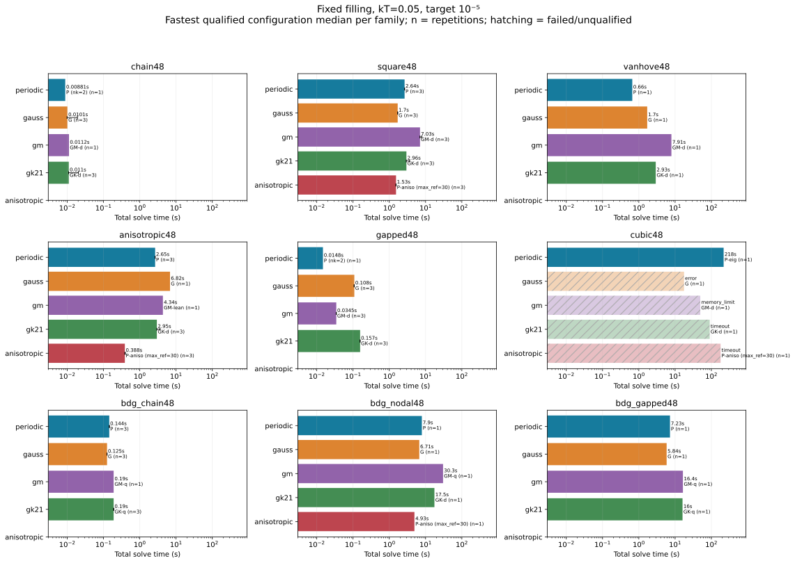
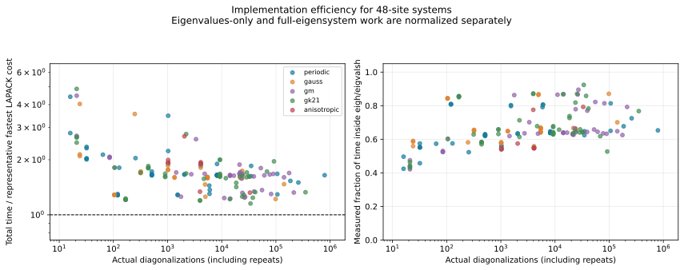
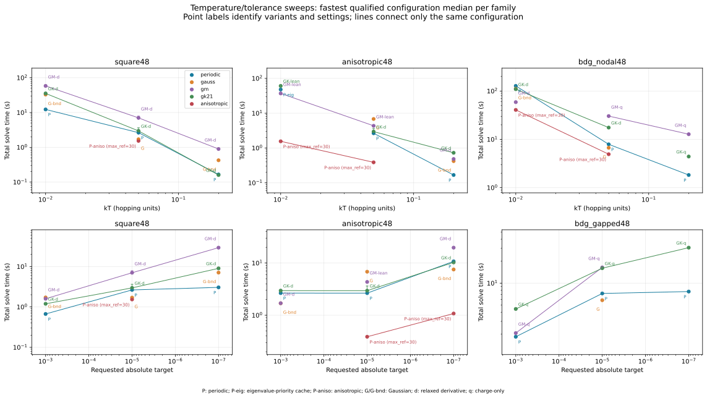
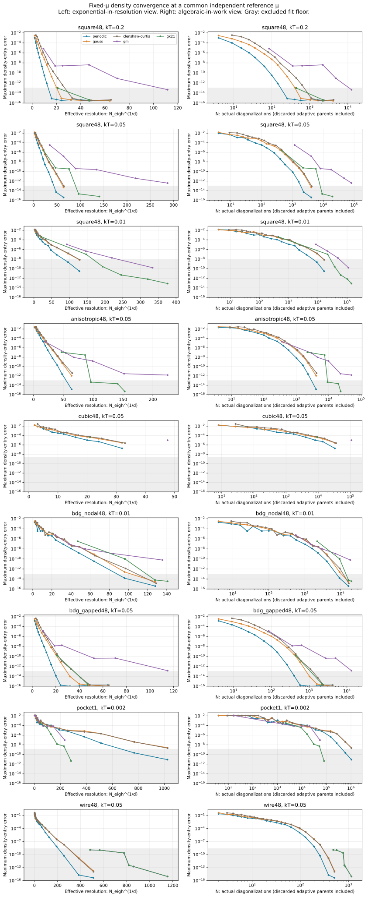

> Historical report: this describes the earlier experimental branch. Its API
> and development recommendations are superseded by the two-family release;
> see the [snapshot README](README.md). Measurements are preserved unchanged.

# Finite-temperature integration in MeanFi

**Periodic quadrature is implemented and useful, but isotropic periodic sampling is not a universal winner.** The strongest demonstrated improvement is directional periodic refinement: 57.51 → 1.556 seconds on the cold anisotropic 48-site metal, about 37×, and about 24× faster than the best tested adaptive competitor there. On cold nodal BdG, however, optimized GM takes 58.96 seconds against directional periodic's 40.73 seconds. On a localized cold pocket, GK uses 13.3× fewer diagonalizations than the complete periodic solve.

The completed study contains **244 fixed-filling solve jobs across 14 models and 37 model/temperature/target groups**, plus **558 retained fixed-μ convergence measurements across nine cases**. Of the full solves, 201 finite-temperature results meet independently checked physical targets. One intentional unvalidated aliasing control fails those checks. The remaining 42 records comprise 40 execution/budget failures and two unqualified T=0 context results. The convergence set contains 545 completed measurements, two refinement-budget errors, and 11 timeouts; all are retained.

For the tested dense workloads, per-point evaluation is already within a small factor of a representative fastest-tested LAPACK budget. The development priority should be **work selection: directional grids, chemical-potential trajectories, accuracy allocation, and memory policies that avoid recomputation**. I would expose the new method now, as this change does, and harden those controls before making it the automatic finite-temperature default.

Recorded on 2026-09-11. This report separates production functionality, measured experiments, and proposed future optimizations.

## What was implemented

`meanfi.PeriodicQuadrature` is a public finite-temperature integration method for normal and BdG systems. It resolves chemical potential and selected density entries on nested periodic grids, doubles the number of points along each periodic axis when needed, and checks a second shifted grid before accepting a result. Normal-state spectra are reusable as chemical potential changes. BdG spectra are recomputed when chemical potential changes because it enters the electron and hole blocks with opposite signs.

The implementation uses dense diagonalization in bounded batches. Its eigensystem cache has an explicit byte limit; exceeding that limit causes recomputation, not an unbounded allocation. Grid limits, batch limits, and cache limits are different controls. The shifted check adds a separate grid and work beyond the accepted grid's point count. Error estimates are empirical grid differences. They are not certified upper bounds for arbitrary periodic Hamiltonians.

The existing automatic finite-temperature default remains `AdaptiveQuadrature` while this study assesses the case for changing it. The new method is directly selectable. The current method supports direct diagonalization, including explicit densification of sparse inputs. It does not provide zero-temperature integration, RationalFOE, or the automatic SCF band-energy integral. Any recommendation to change the default here concerns the tested **dense finite-temperature** workload.

Experimental comparators are kept in the benchmark harness rather than expanding the production API before their behavior has been assessed.

## Comparison contract

The primary workload is a complete **fixed-filling density solve** for a supplied trial Hamiltonian. All chemical-potential searches, Hamiltonian construction, diagonalization, cache management, quadrature refinement, Fourier phases, selected-density contractions, and final validation are included in the reported solve time. Imports, model construction, independent reference generation, and process startup are excluded. Process wall time is also saved for diagnosing timeouts. These are individual density solves starting from μ_guess=0, with warm starts between refinement levels where the method supports them. They do not measure a complete SCF trajectory, a good chemical-potential guess inherited from a previous SCF iteration, or persistent meshes across successive trial Hamiltonians. The timed observable is the selected SCF density layout, not every entry of every density block; full-block correctness is covered separately by implementation tests.

In the main sweep, the common target, ε, means a maximum absolute error of ε in any requested complex density entry and an absolute physical filling error of ε particles **per supercell**. The solver receives ε/4 for its charge-integration estimate and ε/4 for its root residual, leaving a margin for combined error. On 48-site cells, ε=10⁻⁵ particles per cell corresponds to about 2.08×10⁻⁷ particles per site. The report separately records the stricter ε/4 physical-filling check; a root residual and a true physical filling error are different quantities.

A separate target ablation keeps the density-entry target at 10⁻⁵ while relaxing the physical filling target to 10⁻³; charge integration and root residual then each receive one quarter of that filling target. Those rows are ranked separately. The charge target constrains a sum over 48 electron occupations, whereas the density target constrains individual entries. Some excess density accuracy is therefore expected from the shared absolute target; it should not all be blamed on a conservative quadrature estimate.

All primary numerical kernels use complex128 dense matrices. Normal systems have 48×48 matrices; 48-site superconductors have 96×96 BdG matrices. BdG timings therefore must not be interpreted as an equal-matrix-size comparison with normal systems. One-band controls isolate sampling behavior but are not evidence about dense LAPACK efficiency.

The benchmark uses one BLAS/OpenMP thread and runs timed jobs sequentially. The machine is an Intel Xeon Gold 5418Y running Linux, Python 3.12.13, NumPy 2.4.6, SciPy 1.17.1, OpenBLAS 0.3.33, stateful-quadrature 0.2.1, and FermiSimplex 0.2.0. No CPU affinity was pinned. Short timings and small differences therefore warrant repetitions; the main development decisions concern substantially larger differences. See [environment.json](results/environment.json) for the recorded environment.

## Systems and methods

The deterministic model suite includes a disordered chain, a multichannel wire, disordered square and cubic supercells, a clean square system near a van Hove filling, a strongly anisotropic metal, a staggered-potential insulator, and clean p-wave BdG systems in one and two dimensions. The 2D BdG cases include a nodal pₓ state and a fully gapped pₓ+ipᵧ state. The pairing fields are fixed trial fields, not independently converged superconducting solutions. The clean cases permit exact primitive-cell reduction for references; timed methods still operate on the full 48/96 dimensional matrices. Disordered cases avoid that shortcut. The additional multichannel wire has an open 6×8 transverse cross-section and one-cell transport periodicity; its 48 sites do not form a long longitudinal supercell. This matters because cell folding changes the required k-space resolution, even at the same matrix size.

Controls include a one-band chain, a one-band square dispersion, a displaced small Fermi pocket, and a deliberately high Fourier harmonic that aliases on coarse dyadic grids. Temperatures include kT=0.2, 0.05, 0.01, and cold controls at 0.002, in the Hamiltonian's hopping-energy units. Targets span 10⁻³, 10⁻⁵, and 10⁻⁷ for selected larger systems. The exact definitions, random seeds, coordinates, and job settings are in `models.py` and the manifests.

Compared implementations are:

- Periodic nested grids with shifted validation, plus experiments in per-axis refinement, initial grid size, and eigenvalue-priority caching.
- Genz–Malik adaptive cubature in 2D/3D; in 1D the controller uses GK21, so the two names are not different 1D rules.
- Tensor-product GK21 in the same stateful controller, with bounded kernel/evaluator batches.
- Adaptive charge variants that relax the auxiliary derivative target, omit it, or use a fresh density mesh.
- Lean adaptive variants that keep normal eigenvalues rather than full eigenvectors during the charge solve, and cache selected integrand values on a fresh density mesh. BdG charge evaluation contracts electron weights and discards the eigenvectors.
- Increasing-order tensor Gauss–Legendre, including a bounded-memory variant with the same order sequence and acceptance criteria.
- Clenshaw–Curtis in fixed-μ convergence experiments. Its current implementation does not exploit nested-node reuse across separate orders.
- FermiSimplex at T=0 as context only. It is not a same-physics finite-temperature competitor.

This is a comparison of concrete implementations and tested optimizations. It is not an exhaustive optimization of every quadrature family. In particular, the tested stateful adaptive controller subdivides every axis together; it does not implement directional local bisection or iterated one-dimensional adaptivity.

## Independent accuracy assessment

Reference calculations assemble the Fourier Hamiltonian explicitly and form the full covariance matrix before selecting entries. This is independent of the production selected-density contraction. Direct references use shifted, non-dyadic grids. Clean models also use a separately implemented exact primitive-cell formulation; agreement with equivalent full-supercell grids was checked in 20 checks across all five clean model families, at kT=0.05 and 0.01 and μ=−0.37 and +0.19. The maximum density difference was 5.56×10⁻¹⁶ and maximum charge difference was 7.11×10⁻¹⁵.

At least two distinct reference resolutions must agree below one tenth of their respective density and filling targets. Density convergence is checked between the two independently solved fixed-filling reference densities; charge agreement is checked separately at each candidate result's chemical potential. A method's density is compared with the reference density at the reference fixed-filling solution. Candidate physical filling is recomputed at the candidate μ using reference spectra. These checks include root error as well as quadrature error. An unresolved reference is reported as unknown, not as an algorithm failure. Looser targets can still qualify when the tightest target's reference does not.

Reference-grid differences are empirical uncertainty indicators. They do not prove that all possible Fourier aliases have been resolved. Results near a tolerance boundary are kept inconclusive when the reference variation matters. The intentional aliasing control tests a concrete failure of nested-grid differences and the usefulness of the shifted safeguard.

Fixed-μ convergence curves use the same finest reference μ for every method. Every global rule is streamed in one pass with exactly one full diagonalization per quadrature point. Adaptive counts include discarded parent cells. A global-rule curve is an accuracy-versus-prescribed-resolution measurement: it excludes discovering the required order and does not include the preceding plotted orders. It therefore diagnoses sampling efficiency, while the complete fixed-filling timings include order selection, discarded grids, roots, and validation. Error curves are plotted both against actual diagonalization count N and against N^(1/d). Fits exclude the reference/roundoff floor and require at least five distinct counts spanning two error decades. Such fits describe the observed finite range; they do not establish an asymptotic theorem.

## How the LAPACK comparison should be read

For each model, representative matrices are solved using the tested LAPACK drivers `zheev`, `zheevd`, `zheevr`, and `zheevx`, as well as batched NumPy. Input preparation and workspace queries are outside the baseline timer. The baseline uses repeated samples, verifies an eigenvector residual, and selects the fastest measured median. Eigenvalues-only and full-eigensystem costs are measured separately.

The requested efficiency comparison is

\[
R=\frac{t_{\mathrm{complete\ solve}}}
{N_{\mathrm{eigh}}t_{\mathrm{best\ full}}+
 N_{\mathrm{eigvalsh}}t_{\mathrm{best\ values}}}.
\]

Counts include repeated diagonalizations at the same k point, BdG μ changes, discarded adaptive parents, previous quadrature orders, cache recomputation, and shifted validation. The denominator is a representative best-tested diagonalization budget, not a rigorous lower bound or an exact replay of every sampled matrix. The measured fraction of time actually inside `eigh`/`eigvalsh` provides a complementary direct check.

A small R says the implementation is reasonably efficient **for the work it chose to do**. It does not say that it chose a good number of points. Conversely, a large runtime can arise from many mathematically necessary or conservatively selected points even when per-point implementation overhead is small. Charge/density phase timers overlap eigensystem timers and must not all be added as a disjoint breakdown.

## What exponential convergence does and does not establish

For a 2π-periodic observable g, define I=(2π)⁻¹∫g and Qₙ=n⁻¹Σⱼg(2πj/n). With Fourier coefficients cₘ, Qₙ−I=Σ_{ℓ≠0}c_{ℓn}. If g is analytic and bounded by M in a complex strip of width a, its coefficients decay exponentially and |Qₙ−I|≤2M/(exp(an)−1). One can also apply the bound on a narrower bounded substrip. With N=nᵈ points in d dimensions this means exponential decay in N^(1/d), not generally in N. Increasing-order Gaussian quadrature can also converge exponentially for analytic integrands. The rate constants and prefactors matter. [Trefethen and Weideman, 2014, Sections 3 and 8](https://people.maths.ox.ac.uk/trefethen/publication/PDF/2014_149.pdf).

For a finite-range tight-binding Hamiltonian, H(k) is a finite Fourier sum. At positive temperature its matrix Fermi function is analytic in some neighborhood of the real Brillouin zone: on the real zone, the matrix being inverted in [I+exp((H−μI)/kT)]⁻¹ is nonsingular, and compactness gives a nonzero complex neighborhood. For BdG the corresponding function is [I+exp((H_BdG−μQ)/kT)]⁻¹, and the same argument applies. This is an argument about the matrix observable, and does not require individual eigenvectors to be smooth through band crossings. The neighborhood can become narrow as temperature falls. Rigorous finite-smearing Brillouin-zone estimates likewise have temperature-dependent rates and prefactors. [Cancès et al., Section 5.3](https://arxiv.org/pdf/1805.07144).

Fixed-order GK/GM subdivision is different from increasing quadrature order. Its usual local-error analysis is algebraic in cell size, though uniformly repeated composite rules can also converge exponentially through periodic cancellation. Adaptivity is not a guarantee of exponential convergence, and periodicity is not a guarantee that a particular grid is fastest at a finite tolerance. Tensor GK also pays for 21ᵈ nodes per local rule, while the lower-degree Genz–Malik rule is much cheaper per cell. [SciPy cubature documentation](https://docs.scipy.org/doc/scipy/reference/generated/scipy.integrate.cubature.html).

Directional periodic refinement has a clear motivation: if the observable is jointly analytic and uniformly bounded in a product of complex strips whose widths differ by axis, a tensor error estimate can be bounded by a sum of axis contributions proportional to exp(−aⱼnⱼ). Balancing aⱼnⱼ avoids oversampling smooth axes. This deduction motivates the experiment; the implemented directional indicators do not certify those strip widths. Iterated adaptive integration is another plausible way to exploit narrow features. Published work on resolvent Brillouin-zone integrals supports investigating it, but its spectral broadening parameter and complexity claims cannot simply be identified with finite-temperature BdG density integration. [Kaye et al., 2023](https://arxiv.org/pdf/2211.12959).

## Numerical findings and development priorities

The measurements distinguish implementation efficiency from work selection. In the original 133-job matrix, qualified normal 48-orbital calculations lasting at least 0.05 seconds had a median mixed-LAPACK ratio of 1.66; the corresponding BdG median was 1.28. Median measured eigensolver fractions were 64% and 86%. These describe correlated experimental rows, not a population of independent materials. At fixed eigensolve counts, they leave no plausible tenfold bookkeeping improvement. Large gains require fewer sampled points, fewer repeated spectral problems, or a different matrix-function backend.

### Complete fixed-filling runtimes

All times below are seconds. Each entry is the fastest **qualified tested configuration** in its family, using the median when that configuration has repetitions; `n` is the number of qualified timing repetitions. This is a tuned-family comparison, not a comparison of defaults alone. In particular, the periodic column includes starting-grid and cache experiments. The unvalidated periodic ablation never enters these rankings.

`P` is production periodic, `P-cache` is eigenvalue-priority caching, and `P-axis` is experimental directional periodic. `GM-d/GK-d` relax the auxiliary derivative budget; `-q` omits that derivative; `-lean` uses compact payloads and a fresh density mesh. All preserve the stated physical targets and undergo independent checks. `max_n` is the benchmark's global-order limit (production periodic calls it `max_nk`).

“No qualified result” means every tested configuration in that family failed to produce an accepted result within its recorded limits. It is not a measured runtime and does not prove impossibility. “Not run” means no matching experiment. The process monitor caps RSS at 6 GiB and address space at 8 GiB. The baseline timeout is 90 seconds; bounded follow-ups use 120–240 seconds where shown in the manifests. The final cold nodal-BdG comparison gives periodic, directional periodic, bounded Gaussian, derivative-relaxed GM, and derivative-relaxed GK the same 240-second limit. Algorithm-specific refinement/order caps are still different constraints.

#### kT=0.05, density/filling target 1e-5

| Model | Isotropic periodic | Directional periodic | Gaussian | GM | GK |
|---|---:|---:|---:|---:|---:|
| chain48 | 0.00881 (P (nk=2); n=1) | not run | 0.0101 (Gauss; n=3) | 0.0112 (GM-d; n=1) | 0.011 (GK-d; n=3) |
| wire48 | 0.444 (P (max_n=4096); n=3) | not run | 0.348 (Gauss-bounded (max_n=4096); n=3) | not run | 0.285 (GK-d (max_n=4096); n=3) |
| square48 | 2.64 (P; n=3) | 1.53 (P-axis (max_ref=30); n=3) | 1.7 (Gauss; n=3) | 7.03 (GM-d; n=3) | 2.96 (GK-d; n=3) |
| vanhove48 | 0.66 (P; n=1) | not run | 1.7 (Gauss; n=1) | 7.91 (GM-d; n=1) | 2.93 (GK-d; n=1) |
| anisotropic48 | 2.65 (P; n=3) | 0.388 (P-axis (max_ref=30); n=3) | 6.82 (Gauss; n=1) | 4.34 (GM-lean; n=1) | 2.95 (GK-d; n=3) |
| gapped48 | 0.0148 (P (nk=2); n=1) | not run | 0.108 (Gauss; n=3) | 0.0345 (GM-d; n=3) | 0.157 (GK-d; n=3) |
| cubic48 | 218 (P-cache; n=1) | no qualified result | no qualified result | no qualified result | no qualified result |
| bdg_chain48 | 0.144 (P; n=3) | not run | 0.125 (Gauss; n=3) | 0.19 (GM-q; n=1) | 0.19 (GK-q; n=3) |
| bdg_nodal48 | 7.9 (P; n=1) | 4.93 (P-axis (max_ref=30); n=1) | 6.71 (Gauss; n=1) | 30.3 (GM-q; n=1) | 17.5 (GK-d; n=1) |
| bdg_gapped48 | 7.23 (P; n=1) | not run | 5.84 (Gauss; n=1) | 16.4 (GM-q; n=1) | 16 (GK-q; n=1) |

#### kT=0.01, density/filling target 1e-5

| Model | Isotropic periodic | Directional periodic | Gaussian | GM | GK |
|---|---:|---:|---:|---:|---:|
| chain48 | 0.0269 (P; n=1) | not run | not run | 0.0375 (GM-d; n=1) | 0.0374 (GK-d; n=1) |
| wire48 | 1.47 (P (max_n=4096); n=1) | not run | 1.44 (Gauss-bounded (max_n=4096); n=1) | not run | 1.43 (GK-d (max_n=4096); n=1) |
| square48 | 12.3 (P; n=1) | not run | 32.9 (Gauss-bounded; n=1) | 58.3 (GM-d; n=1) | 35.5 (GK-d; n=1) |
| anisotropic48 | 47.8 (P-cache; n=1) | 1.56 (P-axis (max_ref=30); n=1) | no qualified result | 36.9 (GM-lean; n=1) | 60.8 (GK-lean; n=1) |
| bdg_nodal48 | 128 (P; n=1) | 40.7 (P-axis (max_ref=30); n=1) | 112 (Gauss-bounded; n=1) | 59 (GM-d; n=1) | 109 (GK-d; n=1) |

#### Cold scalar controls, kT=0.002, density/filling target 1e-5

| Model | Isotropic periodic | Directional periodic | Gaussian | GM | GK |
|---|---:|---:|---:|---:|---:|
| square1 | 9.65 (P (max_n=4096, max_points=16777216); n=1) | not run | 3.68 (Gauss-bounded (max_n=4096, max_points=16777216); n=1) | 11.3 (GM-d (max_ref=32768); n=1) | 7.24 (GK-d; n=1) |
| pocket1 | 1.83 (P (max_n=4096, max_points=16777216); n=1) | not run | 1.33 (Gauss-bounded (max_n=4096, max_points=16777216); n=1) | 3.1 (GM-d (max_ref=32768); n=1) | 0.325 (GK-d; n=1) |
| alias1 | 0.168 (P (max_n=65536); n=1) | not run | no qualified result | 0.121 (GM-d; n=1) | 0.118 (GK-d; n=1) |

The warm square result is a close competition between directional periodic and Gaussian, with isotropic periodic and GK also within a small factor. Periodic wins clearly over GM on the van-Hove example, but neither that example nor the gapped case establishes a universal rule. The normal gapped row uses a much smaller periodic initial grid than the default; the default's repeated median is 0.167 seconds.

The updated cold nodal-BdG comparison is particularly important: relaxed-derivative **GM takes 58.96 seconds and 39,168 full solves**, GK takes **109.4 seconds and 68,355**, isotropic periodic takes **127.8 seconds and 106,432**, and directional periodic takes **40.73 seconds and 33,178**. Thus GM beats isotropic periodic by about 2.2×, and directional periodic beats the best tested GM by only about 1.45×. Comparing against only the earlier charge-only adaptive variants would materially overstate periodic's advantage.

The wire also prevents overgeneralizing from long supercells. At kT=0.01, the folded chain accepts 32 points (64 solves including validation), whereas the coupled one-cell wire needs 2,048 points (4,096 solves). The same 48×48 matrix size is not the same k-space difficulty. All three tested wire methods take approximately 1.4–1.5 seconds at that temperature. At kT=0.05, three periodic repeats take 0.692, 0.379 and 0.444 seconds; the median is 0.444 against GK's 0.285 and Gaussian's 0.348. This variation is why small timing differences are not treated as decisive.

The cold scalar controls use expanded point/order/refinement caps. Without those controls, a method that exhausted a smaller default cap could look intrinsically inferior. On the displaced pocket, periodic uses **2,097,152 full solves**, GM **480,981**, Gaussian **1,398,080**, and GK **157,437**. GK's 13.3× reduction against periodic becomes a 5.6× wall-time advantage for this scalar implementation. Scalar overhead is unlike 48/96-dimensional LAPACK cost, so this is evidence for local sampling, not a prediction of dense-system speedup. At fixed μ and prescribed resolution, periodic can still be faster in wall time on this scalar example despite using more nodes.

The hatched bars illustrate selected unsuccessful configurations and their elapsed time; they are not successful-runtime rankings. Full failure reasons and all variants are in [the complete comparison CSV](results/comparison.csv).

### Representative LAPACK comparisons

| Model / method | T | Target | Full solves | Values-only | Total seconds | LAPACK budget seconds | Ratio | Eigensolver fraction |
|---|---:|---:|---:|---:|---:|---:|---:|---:|
| square48 / periodic | 0.05 | 1e-5 | 8,192 | 0 | 2.64 | 1.61 | 1.64 | 63.9% |
| square48 / gk21-derivative | 0.05 | 1e-5 | 9,261 | 0 | 2.96 | 1.82 | 1.63 | 63.4% |
| anisotropic48 / periodic-anisotropic | 0.01 | 1e-5 | 4,096 | 0 | 1.56 | 0.803 | 1.94 | 54.7% |
| cubic48 / periodic-eigenvalue-priority | 0.05 | 1e-5 | 547,328 | 245,888 | 218 | 132 | 1.65 | 65.3% |
| bdg_nodal48 / periodic | 0.05 | 1e-5 | 5,888 | 0 | 7.9 | 5.47 | 1.44 | 79.1% |
| bdg_nodal48 / gk21-derivative | 0.05 | 1e-5 | 11,907 | 0 | 17.5 | 11.1 | 1.59 | 65.7% |
| bdg_nodal48 / periodic-anisotropic | 0.01 | 1e-5 | 33,178 | 0 | 40.7 | 30.8 | 1.32 | 79.3% |

These are representative individual runs, rather than a second table of configuration medians. The best tested full-eigensystem driver is typically `zheevd`: approximately 0.194–0.198 milliseconds per 48×48 matrix and 0.929–0.936 milliseconds per 96×96 matrix in this environment. Values-only work is normalized separately. The ratio is not a rigorous lower bound, and the chosen representative matrices need not have exactly the same cost as every integration sample.

### Temperature and tolerance change the ranking

At kT=0.2 on square48, periodic and GK are essentially tied at 0.166 and 0.160 seconds, compared with GM's 0.896. At kT=0.01, periodic takes 12.28 seconds, GK 35.46, and GM 58.33. The temperature dependence is real, but this sweep alone does not predict a universal low-temperature ordering: the pocket and cold BdG results give different orderings.

On square48 at kT=0.05, tightening the common target from 10⁻³ to 10⁻⁷ increases periodic runtime from 0.670 to 3.05 seconds, GK from 1.20 to 9.03, and GM from 1.59 to 29.4. The periodic method crosses a few discrete grid thresholds, whereas local refinement adds many more cells. Those stepwise costs should not be fitted as a smooth complexity law from three targets.

On anisotropic48, the loose 10⁻³ target favors GM over isotropic periodic (1.70 versus 2.66 seconds). At 10⁻⁷, isotropic periodic, GK and bounded Gaussian take 10.77, 10.26 and 7.52 seconds, while directional periodic takes 1.078 seconds. Adaptation along axes is again more consequential than the small ranking changes between isotropic high-order families.

The physical filling target also matters independently of density accuracy. Keeping the square48 density target at 10⁻⁵ but relaxing filling to 10⁻³ reduces periodic work from 8,192 to 2,048 full solves and runtime to 0.677 seconds. Lean GK takes 0.921 seconds and bounded Gaussian 1.70 seconds with those separate targets. The corresponding cubic target-relaxation runs still time out at 120 seconds. This does not justify silently relaxing filling; it argues for a clear physical accuracy contract.

### Observed convergence and fixed-μ sampling

The following table gives selected **density-error** fits to `log(error) = c − a N^(1/d)`. A larger `a` means a steeper fitted decline over the retained interval. Every listed fit uses five distinct work counts above the independently estimated reference floor, spanning at least two error decades. The full [fit CSV](results/convergence-fits.csv) also includes charge, Genz–Malik, GK and Clenshaw–Curtis, both exponential and power-law fits, point ranges, and reasons for insufficient evidence.

| Model | kT | Periodic a | Periodic R² | Gaussian a | Gaussian R² |
|---|---:|---:|---:|---:|---:|
| square48 | 0.2 | 2.025 | 0.9994 | 1.291 | 0.9997 |
| square48 | 0.05 | 0.562 | 0.9938 | 0.4073 | 0.9930 |
| square48 | 0.01 | 0.1595 | 0.9803 | 0.09753 | 0.9910 |
| anisotropic48 | 0.05 | 0.4891 | 0.9989 | 0.3889 | 0.9998 |
| cubic48 | 0.05 | 0.3401 | 0.9898 | 0.2448 | 0.9908 |
| bdg_nodal48 | 0.01 | 0.2431 | 1.0000 | 0.2255 | 0.9925 |
| bdg_gapped48 | 0.05 | 1.368 | 0.9997 | 0.8538 | 0.9998 |
| pocket1 | 0.002 | 0.02106 | 0.9901 | 0.0116 | 0.9734 |
| wire48 | 0.05 | 0.08083 | 0.9983 | 0.05581 | 0.9968 |

The periodic rate on square48 falls from about 2.03 at kT=0.2 to 0.159 at kT=0.01, consistent with a narrowing analytic neighborhood. Gaussian also displays rapid convergence, so exponential convergence is not an exclusive periodic advantage. High fitted R² is not a proof of an asymptotic law: at square48, kT=0.05, Gaussian's power-law fit actually has a slightly higher R² than its exponential fit over this short interval.

There are 68 usable descriptive fits out of 90 method/case/observable combinations. The remaining 22 lack enough distinct resolved samples. GK often already produces very small errors at its first or second selected mesh; those cases cannot support a reliable rate fit. In cold nodal BdG, GM's fitted power-law description is better than its exponential description (R²≈0.988 versus 0.889), but the range is still too limited for a theorem. The pocket's delayed convergence also shows why stopping a global-rule curve before its transition to the analytic regime can mislead.

Below are the smallest **observed** diagonalization counts meeting both density and physical charge targets of 10⁻⁵ with a reference margin. These measurements are given the independently known μ. Global-rule orders are prescribed, and adaptive tolerances are chosen retrospectively from the tested set using the reference. Neither order discovery nor shifted validation is included for global rules. These are sampling diagnostics, not demonstrated complete-solve speedups or proven minimum counts.

| Model | kT | Periodic | Gaussian | Clenshaw–Curtis | GM | GK |
|---|---:|---:|---:|---:|---:|---:|
| square48 | 0.2 | 36 | 64 | 81 | 357 | 441 |
| square48 | 0.05 | 400 | 576 | 625 | 4,097 | 2,205 |
| square48 | 0.01 | 2,304 | 9,216 | 9,409 | 21,369 | 21,609 |
| anisotropic48 | 0.05 | 576 | 1,024 | 1,089 | 2,941 | 2,205 |
| cubic48 | 0.05 | 32,768 | none observed | 35,937 | none observed | none observed |
| bdg_nodal48 | 0.01 | 1,024 | 1,600 | 1,681 | 1,445 | 9,261 |
| bdg_gapped48 | 0.05 | 64 | 144 | 169 | 357 | 441 |
| pocket1 | 0.002 | 65,536 | 147,456 | 66,049 | 54,417 | 16,317 |
| wire48 | 0.05 | 128 | 192 | 193 | 483 | 483 |

The square48 examples favor periodic sampling even after comparing actual discarded-parent counts for adaptivity. Cold nodal BdG is less decisive: periodic, Gaussian and GM achieve comparable physical accuracy at roughly 1,000–1,600 solves, despite much larger differences in complete filling solves. The pocket favors GK in sample count. These distinctions motivate improving the controller separately from selecting the integration rule.

In 3D, the effective-resolution axis is N^(1/3), not N. Exponential convergence in resolution can still imply a large tensor cost. The cubic adaptive curves have only their loosest requested tolerance completed under the 45-second per-curve-point limit; their five tighter requests time out for each family. “Insufficient fit” here is missing evidence, not a measured convergence rate.

The left panels test exponential decay in effective per-axis resolution; the right panels show power-law behavior in total work. Gray regions mark the excluded reference/roundoff floor. Error is not assumed monotone. The companion [charge-convergence figure](results/figures/convergence-charge.svg), [all 558 curve samples](results/convergence-samples.csv), and [all target-specific observed-work comparisons](results/fixed-mu-observed-work.csv) preserve the other views.

### T=0 context

FermiSimplex completed the chain in 0.0336 seconds and the anisotropic model in 8.16 seconds; the square run timed out at 90 seconds. These runs do not have independently qualified T=0 references in this study, and their zero-temperature occupations represent different physics. They are retained as context and excluded from finite-temperature accuracy/runtime rankings. The finite-temperature results should not be described as a validated superiority claim over FermiSimplex.

### Directional refinement is the largest demonstrated sampling gain

On the anisotropic 48-site metal at kT=0.01 and target 10⁻⁵, isotropic periodic integration took 57.51 seconds, the eigenvalue-priority cache variant took 47.83 seconds, and directional periodic integration took 1.556 seconds. The directional grid is 256×8 instead of 256×256. Including shifted validation, it uses 4,096 full solves; the original isotropic version uses 133,184 full plus 126,528 values-only solves. Both use 28 root evaluations. Their returned densities agree to 2.92×10⁻¹⁵ and μ agrees to about 2.5×10⁻¹⁴.

The independently checked directional density error is 7.02×10⁻⁹ and physical filling error is 2.73×10⁻⁷, both within the requested overall 10⁻⁵ targets. The stricter quarter-budget physical filling assessment is inconclusive because of reference-grid variation, not a measured violation. The smaller rectangular grid also fits its eigensystems in about 73 MiB, avoiding the cache-capacity threshold. This is about a 37× improvement over the original isotropic implementation and a 31× improvement over the tested cache variant.

The example is favorable to axis-aligned refinement by construction. It does not demonstrate the same benefit for rotated features, comparable difficulty in every direction, or curved Fermi surfaces. The cubic directional run times out at 180 seconds during shifted validation. Its last completed 64×32×32 grid already meets the density indicator, but the summed charge indicator forces another axis refinement. Its first-come cache also causes considerable recomputation. This failure combines error control, sampling and storage, rather than proving that directional refinement is intrinsically poor in 3D.

### Derivative budgets and root trajectories matter

For square48 at kT=0.05 and target 10⁻⁵, relaxing only the auxiliary derivative integration criterion reduces bounded GM from 25.16 to 7.87 seconds and GK from 6.88 to 2.96 seconds. On anisotropic48 the reductions are 18.58 to 4.60 and 10.19 to 2.95 seconds. These are useful three-to-fourfold changes, mostly through reduced sample counts. The physical charge and density targets are preserved and independently checked.

Removing the derivative is not uniformly better. On nodal BdG at the same temperature and target, relaxed-derivative GK takes 17.54 seconds and 11,907 full solves; charge-only GK takes 43.19 seconds and 37,485 solves. Charge-only has a better per-solve implementation ratio, 1.24 versus 1.59, but its root trajectory creates a larger inherited mesh. The complete solve is what must be optimized.

Normal derivatives are inexpensive once spectra are cached. For BdG, a batched trace derivative could preserve useful root information without constructing every density-derivative block. That is a proposed development direction, not a measured implementation here. The experimental factor-100 derivative relaxation is not a universal physical error budget. Another unimplemented opportunity is to demand coarse charge accuracy far from the requested filling and tighten it near the root. The cubic compact runs spend heavily at the initial μ=0 before reaching the final μ≈−0.398. Doing this safely requires uncertainty-aware bracket updates and a way to refine or invalidate cached root samples; merely loosening the current fixed tolerance would not establish the same contract. This opportunity is distinct from reusing the final charge mesh for density, because it avoids paying for an over-refined intermediate-μ mesh in the first place.

### Storage policy is a separate decision from the quadrature rule

On square48, compact GM reduces monitored peak RSS from approximately 744 to 137 MiB, with runtime remaining near 7.5 seconds. Compact GK reduces RSS from 429 to 180 MiB but increases runtime from 2.96 to 3.85 seconds: eigenvalues are retained for charge, and vectors are recomputed for a fresh density mesh. Keeping a mesh does not require retaining all eigenvectors. The compact density cache still grows with the number of nodes and selected outputs; it is not constant-memory integration.

In 3D, bounded Gaussian storage removes a roughly 9-GiB eigenvector allocation, bringing measured RSS to about 715 MiB. It then exhausts its point budget rather than its memory allocation. Compact GM and GK stay below roughly 650 MiB in their strict cubic runs, but GM exhausts 2,000 refinements and GK times out during charge integration after about 1.7 million values-only solves. Removing the memory failure does not remove the sampling demand.

The normal eigenvalue-priority cache lets strict cubic periodic integration finish in 218.0 seconds, with independently checked density error 1.89×10⁻⁸ and physical filling error 7.30×10⁻⁷. It performs 547,328 full plus 245,888 values-only solves. Its mixed LAPACK budget is 132.4 seconds, giving a ratio of 1.65. The original cache policy timed out at 240 seconds; this censored comparison does not establish an exact speedup.

### Validation and startup controls

For the deliberate cos(16k) alias, disabling shifted validation produces a nominal success after only 16 points. The reported charge error is zero and density error about 2×10⁻¹⁶, while independent errors are 0.556 in filling and 0.661 in density. The guarded method rejects the coarse alias and, with a sufficient grid limit, produces a qualified result. A single shifted grid is still an empirical safeguard, not a certificate against every possible alias.

On the gapped normal system, starting periodic integration at nk=2 reduces the work from 512 to 32 full solves and runtime from a repeated median of 0.167 to 0.0148 seconds. The independently checked density error is 6.12×10⁻¹¹. These short startup measurements are single runs, and their small absolute times should not drive a broad default decision. They do show why a comparison that tunes adaptive methods but fixes an unnecessarily large periodic starting grid would be misleading.

### A concrete example of conservative work selection

At the independently known reference μ, a prescribed 32³ periodic grid for cubic48 takes 11.04 seconds and has density error 1.87×10⁻⁷ and physical charge error 7.30×10⁻⁷. Both meet the overall 10⁻⁵ targets. The complete eigenvalue-priority periodic solver reaches 64³ and takes 218.0 seconds. The previous 16³ grid has density error 4.32×10⁻⁵ and charge error 1.90×10⁻⁴, so a coarse/fine difference can remain too large even when the fine estimate is already accurate.

This is **not a measured twentyfold end-to-end speedup**: the prescribed-grid calculation is given the correct μ and resolution, and omits order selection and validation. It diagnoses why a useful integration rule can still have a costly controller. Finding μ, uncertainty checks, discarded levels, and cache recomputation must all remain in a proposed replacement's benchmark. Nonmonotonic charge errors—such as the worse 24³ result compared with 20³—also rule out blindly extrapolating a smooth error curve from two samples.

At the reference μ of the cold nodal BdG case, the smallest tested counts meeting both overall 10⁻⁵ physical targets are 1,024 for periodic, 1,600 for Gaussian, and 1,445 for GM, each taking approximately two seconds. GM reaches this observed error with a requested adaptive tolerance of 10⁻³; that is an oracle selection based on the reference, not a justified generic tolerance relaxation. The corresponding complete filling solves cost much more. This reinforces the distinction between the accuracy achievable by sampled integrals and the work required by the current root/refinement controllers to recognize convergence. The fixed-μ table uses the overall physical charge target, while complete solves reserve quarter budgets for root residual and charge integration.

## Release recommendation

Periodic quadrature deserves a supported place in MeanFi and is a strong candidate for the usual dense finite-temperature path. The current evidence does **not** establish that the isotropic implementation is the best generic method, and I would keep the automatic default unchanged for this release step while hardening directional refinement. A default need not win every case, but its grid, budget, and error contracts need to be reliable across the intended workloads.

The highest-value development work is:

1. **Move directional periodic refinement into a shared production integration engine.** Its demonstrated benefit survives comparisons with the optimized adaptive paths and extends to nodal BdG. Test coupled and rotated features, similar difficulty in every axis, failed shift checks, complete/selected density layouts, and bounded caches. Define rectangular-grid shape, initial resolution, per-axis limits, and cumulative versus per-grid work explicitly. The prototype's power-of-two axis handling should not silently replace the production method's support for odd initial nk.
2. **Improve work selection and accuracy allocation.** Separate physical filling, density-entry, and derivative accuracy; make their units explicit. Investigate uncertainty-aware coarse-to-fine charge solves so an intermediate μ does not receive unnecessarily strict final accuracy. Investigate earlier fine-grid validation or better refinement indicators, but retain alias checks and independently verify physical errors. The existing experiments do not justify a universal tolerance-relaxation factor.
3. **Share the useful storage and evaluation policies across families.** Bound expensive matrix batches, retain inexpensive normal spectra preferentially, and make full eigenvector retention optional. Compact adaptive payloads remove real memory failures; their runtime tradeoff depends on the problem. These improvements belong below the sampling algorithm where possible, rather than becoming many permanent public method classes.
4. **Retain and develop a local adaptive alternative.** Cold localized pockets demonstrate a meaningful point-count advantage for GK. Directional local bisection or iterated 1D adaptivity are not represented by the current all-axis stateful splitter and remain credible competitors, especially in 3D. The present study cannot dismiss them.

I would not prioritize a broad rewrite of dense per-point bookkeeping for speed. On the tested 48/96-dimensional workloads, most completed runs already spend a substantial fraction of their time in eigensolvers and lie within a small factor of the measured LAPACK budget. The demonstrated order-of-magnitude opportunity is choosing substantially less work.

The new production PeriodicQuadrature is explicit and tested. Directional refinement, eigenvalue-priority caching, compact adaptive payloads, tensor-GK injection, and increasing-order Gaussian variants remain clearly labeled benchmark experiments in this change. They should be promoted through shared code and focused contract tests, rather than copying whole experimental implementations into the public API. The dense study does not settle sparse/RationalFOE performance, disordered BdG performance, 3D superconductors, zero-temperature superconducting integration, or automatic finite-temperature SCF energy reporting.

## Validation

The required test/lint suite passed 283 checks, with 40 performance cases deselected, in the locked mid environment. It includes 24 new periodic tests covering normal and BdG paths, selected and full density layouts, 2D/3D and zero-dimensional systems, odd initial grids, cache limits, alias detection, work budgets, tolerance policy, and public nonzero-interaction SCF use. The strict Sphinx build passed. Twenty independent primitive/full-supercell reference crosschecks also passed; their maximum density discrepancy was 5.56×10⁻¹⁶.

The timed benchmarks supplement those tests with independent physical accuracy checks. Agreement between numerical reference grids remains empirical, and no measured success is described as a rigorous error certificate.

## Reproducing and inspecting the study

The original README, preserved inside the final source archive, contains commands to reproduce all 244 full-solve jobs, independent references, LAPACK baselines, 558 retained fixed-μ measurements, and plots. Numerical jobs run sequentially with one BLAS/OpenMP thread. The source manifests retain the tested settings and limits.

The compact, durable evidence is in [results/](results/README.md):

- [Complete comparison CSV](results/comparison.csv), including failures, actual eigensolve counts, timing stages, physical errors and source hashes.
- [Convergence samples](results/convergence-samples.csv), [fits](results/convergence-fits.csv), and [fixed-μ observed work](results/fixed-mu-observed-work.csv).
- [Environment](results/environment.json), [LAPACK driver measurements](results/lapack.json), [test/build validation](results/validation.json), and [reference crosschecks](results/reference-crosschecks.json).
- [Final source snapshot](results/final-source-snapshot.tar.gz), including the original experimental harness and reproduction instructions.

This compact release snapshot omits raw spectra, full logs, raw-record archives and the duplicate earlier source archive. The CSV tables retain recorded comparisons, and the final source archive allows independent references to be regenerated. The complete historical workspace contained additional generated outputs under `build/periodic-study`.

The initial source archive was captured before later helper scripts and supplemental manifests were added. Raw records retain their source hashes; a differing aggregate hash can reflect those additions. The final source archive preserves the completed implementation and harness. No claim is made that every historical record shares an identical aggregate source hash. [Provenance metadata](results/provenance.json) records archive contents and the base revision.
