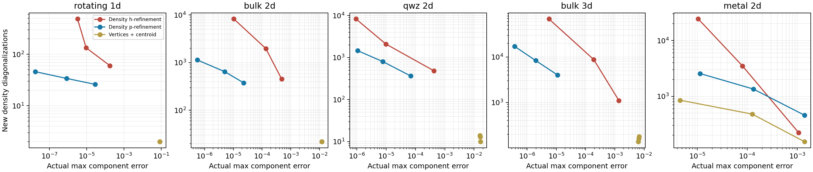
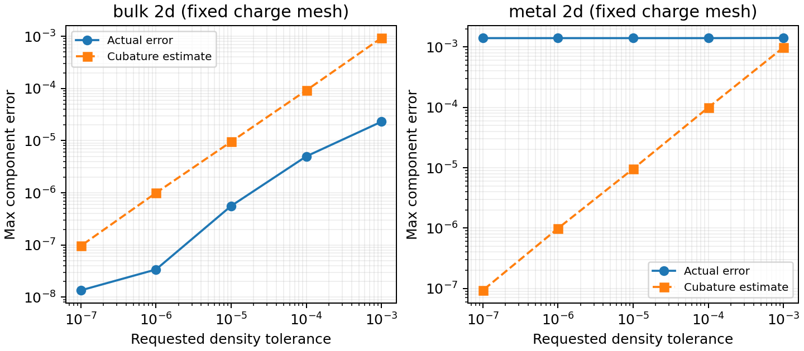

# Density p-cubature experiment

This is the initial experiment. See the [follow-up implementation and validation](../density_p_improvements/README.md) for linear cut correction, the hybrid estimator, selective parallelism, and the current published dependency pin. The bundled companion patch now tracks that follow-up; use commit `813df5a` to reproduce the original backend below.

Implemented on `codex/density-p-cubature` in MeanFi and the companion FermiSimplex
checkout at `build/deps/fermisimplex`. FermiSimplex commit: `813df5a`, based on
MeanFi's pinned `7921df1`. AdaptiveSimplex is unchanged at `57df885`.
The [companion patch](fermisimplex.patch) is included so this experiment can be
reproduced without publishing a dependency branch. The public dependency pin
in `pyproject.toml` remains unchanged until the backend change is published;
install the local companion before running this MeanFi branch.

## What changed

Charge integration and the fixed-filling chemical-potential solve are unchanged.
Density now raises cubature degree on the charge mesh without splitting it.
Fixed-mu density calls now explicitly run charge integration first. The initial
pair is vertices versus vertices-plus-centroid, followed by nested analytic
Grundmann–Moeller rules through degree 21. A priority queue promotes the largest
local indicator. Charge vertices and nested interior samples are reused; only
selected density components are retained at interior points.

The default is `AdaptiveSimplex(density_max_degree=21)`. Setting
`density_max_degree=2` restricts it to the initial pair, and failure to meet the
tolerance raises rather than silently accepting the result. `max_refinements`
limits density order promotions separately from charge splits. Internal
statistics distinguish `p_refinements` from geometric `refinements`.

Cut simplices use a fixed occupied volume fraction for each band, as requested.
Consequently the density error estimate covers cubature of that approximation,
not the total error from approximating cut occupation. The onsite trace agrees
with the linear-simplex charge. The optional band-energy value still uses the
existing occupied-vertex rule on the charge mesh; it is not p-adapted by this
change and its error is not covered by the density cubature estimate.

## Main comparison

Linux x86-64, Intel Xeon Gold 5418Y; GCC 14.3, release build, NumPy 2.4.6;
one BLAS/OpenMP thread, one warmup and median of three measured runs. Two
orbitals; all matrix entries at the onsite and positive nearest-axis lattice
vectors were requested. Both density algorithms start from independently
constructed but identical charge meshes. The legacy h estimator and the new
sum-of-local-norms p estimator differ, so equal requested tolerances do not imply
equal actual errors. Both are shown below. Timing measures complete density
calls; total speedup also includes charge integration.

At charge and density tolerances of **1e-5**:

| Model | h actual error | p actual error | h / p new density spectra | h / p density time | Density speedup | Total speedup |
|---|---:|---:|---:|---:|---:|---:|
| rotating_1d | 3.22e-06 | 1.72e-08 | 488 / 46 | 2.56 / 0.187 ms | 13.7x | 9.7x |
| bulk_2d | 1.04e-05 | 5.59e-07 | 8,280 / 1,138 | 83.7 / 2.3 ms | 36.4x | 28.8x |
| qwz_2d | 9.33e-07 | 1.07e-06 | 8,306 / 1,460 | 83.5 / 4.39 ms | 19.0x | 15.5x |
| bulk_3d | 5.56e-06 | 3.7e-07 | 68,648 / 17,172 | 1.67e+04 / 36.9 ms | 453.8x | 369.2x |
| metal_2d | 1.05e-05 | 1.14e-05 | 24,370 / 2,561 | 378 / 6.2 ms | 61.1x | 4.0x |

The very large 3D timing gain includes avoiding the growing geometric mesh and
its controller costs; the diagonalization reduction is about 4x, not hundreds
of times. At loose 3D tolerance (1e-3), p uses *more* new spectra (4,018 versus
1,104), though its actual error is much smaller and runtime is lower.
Charge work dominates the tight metallic p calculation, limiting total speedup.

The 1D rotating-projector and separable 2D metal references are analytic. The
other references use periodic midpoint grids with resolution doubled from
128 to 256 in 2D and 64 to 128 in 3D; the largest change is below 9e-15.
The benchmark source gives the Hamiltonians and their Fourier conventions.
A uniform-grid work/error ladder is included in the raw data. Smooth periodic
insulators can be extremely efficient on uniform grids: this experiment does
not establish that p-simplex integration beats uniform integration in general.



[PDF figure](work_vs_error.pdf) · [Raw mesh-sweep records](mesh_sweep.json)

## Fixed charge mesh: bulk improvement and metallic floor

Hold charge tolerance at 1e-3 and decrease density tolerance from 1e-3 to 1e-7:

- Bulk 2D actual error falls from 2.30e-5 to 1.35e-8, with 376 to 2,968 new
  density spectra. The charge mesh stays fixed.
- Metal 2D actual error stays near 1.40e-3, while the cubature estimate falls
  below 1e-7. This is the frozen occupation error, invisible to p-refinement.



[PDF figure](fixed_mesh.pdf) · [Raw fixed-mesh records](fixed_mesh.json)

Vertices-plus-centroid alone improves the initial bulk values but is not enough
on these meshes: at the tightest charge tolerance it leaves errors of about
1.19e-2 (bulk 2D), 1.57e-2 (QWZ 2D), and 6.75e-3 (bulk 3D). Higher degrees are
necessary. The results support a substantial bulk efficiency improvement, but
do not establish a universal asymptotic exponent. Order is capped, signed
weights amplify roundoff, and nonsmooth projectors can exhaust the available
rules. The stopping estimate is empirical, not a certificate.

## Larger Hamiltonians

Independent identical blocks of the bulk 2D model give 8 and 32 orbitals.
All 2-by-2 block components are requested; known zero inter-block entries are
omitted. These synthetic models measure matrix-size cost, not more complicated
band crossings. At density and charge tolerance 1e-5:

| Orbitals | h density time | p density time | Density speedup | h / p actual error |
|---|---:|---:|---:|---:|
| 8 | 172 ms | 5.71 ms | 30.2x | 1.04e-05 / 5.59e-07 |
| 32 | 927 ms | 34.3 ms | 27.0x | 1.04e-05 / 5.59e-07 |

[Raw matrix-size records](matrix_sizes.json)

## Validation

- 7 native test executables pass, including every barycentric monomial through
  degree 21 in dimensions 1, 2, and 3, and nesting of successive node sets.
- 125 FermiSimplex Python tests pass, including 23 new tests for exact Fourier
  projectors, partial and half occupation, selected/duplicate components,
  node reuse, unchanged geometry, budget/degree failure and the cut-error floor.
- 163 MeanFi tests pass with warnings treated as errors; 40 performance tests
  were deselected. Existing density accuracy, fixed-filling and SCF tests pass.
- Ruff and git whitespace checks pass.

## Reproduce

From the MeanFi checkout, with the existing latest pixi environment containing
CMake, Ninja, a compiler, nanobind, scikit-build-core, NumPy and LAPACK:

```bash
# Uses build/deps/fermisimplex if present; otherwise clones the pinned source
# and applies the included companion patch. Set PYTHON for another environment.
CXX="$PWD/.pixi/envs/latest/bin/x86_64-conda-linux-gnu-c++" tools/install_fermisimplex_local.sh

OPENBLAS_NUM_THREADS=1 OMP_NUM_THREADS=1 .pixi/envs/latest/bin/python -m performance.benchmarks.density_p_cubature
OPENBLAS_NUM_THREADS=1 OMP_NUM_THREADS=1 .pixi/envs/latest/bin/python -m performance.benchmarks.density_p_cubature --models bulk_2d metal_2d --methods p --charge-tol 1e-3 --tolerances 1e-3 1e-4 1e-5 1e-6 1e-7 --output performance/results/density_p_fixed_mesh.json
OPENBLAS_NUM_THREADS=1 OMP_NUM_THREADS=1 .pixi/envs/latest/bin/python -m performance.benchmarks.density_p_cubature --models bulk_2d --copies 4 16 --methods h p --output performance/results/density_p_matrix_sizes.json
.pixi/envs/latest/bin/python -m performance.benchmarks.plot_density_p_cubature
```

The plotting command reads the committed records in this directory. The public
FermiSimplex pin must be updated after the companion commit is published before
this becomes a normal dependency-resolved release. No changes were pushed.
